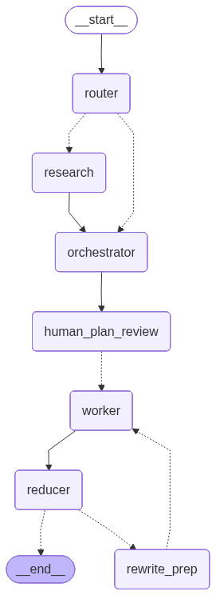

```
██████╗ ██╗      ██████╗  ██████╗      █████╗  ██████╗ ███████╗███╗   ██╗████████╗
██╔══██╗██║     ██╔═══██╗██╔════╝     ██╔══██╗██╔════╝ ██╔════╝████╗  ██║╚══██╔══╝
██████╔╝██║     ██║   ██║██║  ███╗    ███████║██║  ███╗█████╗  ██╔██╗ ██║   ██║   
██╔══██╗██║     ██║   ██║██║   ██║    ██╔══██║██║   ██║██╔══╝  ██║╚██╗██║   ██║   
██████╔╝███████╗╚██████╔╝╚██████╔╝    ██║  ██║╚██████╔╝███████╗██║ ╚████║   ██║   
╚═════╝ ╚══════╝ ╚═════╝  ╚═════╝     ╚═╝  ╚═╝ ╚═════╝ ╚══════╝╚═╝  ╚═══╝   ╚═╝   
```

<div align="center">

**An end-to-end, LangGraph-powered blog writing system.**  
Plan → Research → Draft → Critique → Illustrate → Publish.

[](https://python.org)
[](https://langchain-ai.github.io/langgraph/)
[](https://openai.com)
[](https://streamlit.io)
[](./LICENSE)

</div>

---

## What Is BlogAgent?

Writing long-form technical content is hard. Not because the ideas are hard — but because the *process* is chaotic: you plan, forget the plan, draft out of order, repeat yourself across sections, scramble for images, and circle back to fix inconsistencies at the end.

**BlogAgent automates that entire lifecycle** using a structured multi-agent pipeline built on LangGraph. Give it a topic. It plans, researches, fans out parallel section writers, self-critiques, generates images, and hands you a single, portable `.md` file — with images baked in as base64 URIs — ready to publish or hand off to an editor.

### The Loop at a Glance

```
Topic
  │
  ▼
[Router] ──────────────────► Decides: closed_book / hybrid / open_book
  │
  ▼
[Research] (optional) ──────► Tavily web queries → structured Evidence
  │
  ▼
[Orchestrator] ─────────────► Builds a typed Plan with ordered Tasks
  │
  ▼
[HITL Plan Review] ─────────► LangGraph interrupt() — you approve or edit
  │
  ▼
[Worker Fanout] ─────────────► Parallel section drafters (via LangGraph Send)
  │
  ▼
[Reducer Subgraph]
  ├─ merge_content ──────────► Concatenates sections, inserts image placeholders
  ├─ critic_node ────────────► Scores output; may trigger bounded rewrite loop
  ├─ decide_images ──────────► Plans up to 3 ImageSpec entries
  └─ generate_and_place ─────► gpt-image-1 → images/ → inline markdown links
  │
  ▼
Final Markdown (self-contained, images as data URIs)
```
<p align="center">
  
</p>
---

## Key Features

| Feature | Description |
|---|---|
| 🧠 **Structured Planning** | Strongly-typed `Plan` + `Task` Pydantic models ensure contracts between nodes |
| 🔍 **Optional Web Research** | Tavily integration for recent or evidence-heavy topics |
| ⚡ **Parallel Drafting** | Workers fan out concurrently via LangGraph `Send` |
| 🔁 **Self-Critique Loop** | Critic node scores output and triggers bounded rewrites |
| 🖼️ **AI Image Generation** | `gpt-image-1` images planned, generated, and placed automatically |
| ✋ **Human-in-the-Loop** | LangGraph `interrupt()` pauses for plan approval before writing begins |
| 💾 **SQLite Checkpointing** | Full resume/inspect capability with persistent graph state |
| 📦 **Portable Output** | Single `.md` with images embedded as base64 data URIs |
| 🌐 **Streamlit Frontend** | Streaming UI with live lifecycle events and one-click download |

---

## Quick Start

### Prerequisites

- Python **3.14+**
- `OPENAI_API_KEY` — required (text generation + image generation)
- `TAVILY_API_KEY` — optional (enables web research mode)

### Installation

```powershell
# Clone the repo
git clone https://github.com/SambhavSurthi/BlogAgent.git
cd BlogAgent

# Create and activate virtual environment
python -m venv .venv
.\.venv\Scripts\Activate.ps1   # Windows
# source .venv/bin/activate     # macOS/Linux

# Install dependencies
pip install -r requirements.txt
```

### Run the UI

```powershell
streamlit run src/frontend.py
```

1. Enter your `OpenAI` key (and optionally `Tavily`) in the sidebar.
2. Type a topic.
3. Hit **Generate Blog ✦**.
4. Review the plan when the HITL checkpoint pauses execution.
5. Resume → watch sections stream in → download your portable `.md`.

### Programmatic Usage

```python
from src.backend_updated import app

config = {"configurable": {"thread_id": "my-run-001"}}
initial_state = {"topic": "How transformers changed NLP"}

try:
    result = app.invoke(initial_state, config=config)
    print(result["final_md"])
except GraphInterrupt:
    # Handle HITL plan review — inspect state, then:
    app.invoke(Command(resume={"approved": True}), config=config)
```

---

## Architecture Deep Dive

### Graph Structure

BlogAgent is implemented as a **LangGraph StateGraph** with a nested reducer subgraph. The top-level graph handles routing, research, orchestration, HITL, and worker fanout. The reducer subgraph encapsulates merge → critique → image planning → image generation as an isolated, resumable unit.

```
┌─────────────────────────────────────────────────────────┐
│                    Top-Level Graph                       │
│                                                         │
│  router ──► research? ──► orchestrator ──► [HITL]       │
│                                              │          │
│                              ┌───────────────┘          │
│                              ▼                          │
│                    worker_1 ─┐                          │
│                    worker_2 ─┼──► Reducer Subgraph      │
│                    worker_N ─┘         │                │
│                                        ▼                │
│                              ┌──────────────────┐       │
│                              │  merge_content   │       │
│                              │  critic_node     │       │ 
│                              │  decide_images   │       │
│                              │  gen_and_place   │       │
│                              └────────┬─────────┘       │
│                                       ▼                 │
│                                  final_md               │
└─────────────────────────────────────────────────────────┘
```

### Node Responsibilities

#### `router`
- **Input:** raw `topic: str`
- **Output:** `RouterDecision` — sets `mode` (`closed_book | hybrid | open_book`) and `queries`
- **Logic:** avoids triggering research for evergreen/timeless topics; prefers closed-book for conceptual content

#### `research` *(conditional)*
- **Input:** queries from `RouterDecision`
- **Output:** `evidence: List[EvidenceItem]`
- **Logic:** calls Tavily, filters results by recency for `open_book` mode, skipped entirely for `closed_book`

#### `orchestrator`
- **Input:** topic, evidence, mode, style profile
- **Output:** `Plan` — a structured blueprint with title, audience, tone, kind, constraints, and ordered `Task` list
- **Logic:** constructs a comprehensive writing plan respecting evidence and style; emits a `plan_ready` event to the frontend

#### `human_plan_review` *(HITL)*
- Calls LangGraph's `interrupt()` — graph execution **pauses** here
- The Streamlit UI surfaces the plan for review
- Host resumes with `Command(resume={"approved": True})` or provides edits
- Enables catching structural problems before expensive drafting begins

#### `worker` *(parallel)*
- **Input:** `Task`, `Plan`, filtered `Evidence`, `StyleProfile`
- **Output:** one markdown section string per task
- **Concurrency:** LangGraph `Send` dispatches all workers simultaneously; results collected as `sections: List[Tuple[int, str]]`

#### `merge_content`
- Concatenates sections in `task.id` order
- Inserts `[[IMAGE_N]]` placeholders at section boundaries

#### `critic_node`
- Scores the merged draft across dimensions (coherence, depth, style, evidence use)
- If quality threshold not met → emits `rewrite_instructions` → loops back
- Loop is **bounded** (max iterations configurable) to prevent infinite rewrites

#### `decide_images`
- Reads the merged draft and critic scores
- Plans up to **3** `ImageSpec` entries: prompt, placement, size, quality, filename
- Quality default: `low` (suitable for drafts; swap to `high` for production)

#### `generate_and_place_images`
- Calls OpenAI `gpt-image-1` for each `ImageSpec`
- Writes image bytes to `images/<filename>`
- Replaces `[[IMAGE_N]]` placeholders with proper markdown image links
- Frontend re-encodes as `data:image/png;base64,...` URIs for portability

---

## State Schema

The graph carries a typed `State` object throughout execution. Key fields:

```python
{
    "topic": str,                          # Original input topic
    "as_of": str,                          # ISO datetime of run start
    "mode": "closed_book|hybrid|open_book",
    "queries": List[str],                  # Tavily search queries
    "evidence": List[EvidenceItem],        # Research results
    "plan": Plan,                          # Structured writing plan
    "sections": List[Tuple[int, str]],     # (task_id, markdown) pairs
    "md_with_placeholders": str,           # Merged draft before images
    "image_specs": List[ImageSpec],        # Planned images
    "final_md": str,                       # Completed markdown output
}
```

### Streaming Events

The frontend subscribes to these lifecycle events emitted by the graph:

| Event | Payload | When |
|---|---|---|
| `node_start` | `{node: str}` | Before each node executes |
| `node_end` | `{node: str, duration_ms: int}` | After each node completes |
| `plan_ready` | `{plan: Plan}` | After orchestrator; triggers HITL panel |
| `image_specs` | `{specs: List[ImageSpec]}` | After decide_images |
| `final` | `{md: str, image_count: int}` | On completion |

---

## Pydantic Models

All inter-node contracts are enforced via Pydantic. This makes checkpointing safe, state inspection reliable, and node boundaries explicit.

### `Task`

```python
class Task(BaseModel):
    id: int
    title: str
    goal: str
    bullets: List[str]             # Key points to hit in this section
    target_words: int              # Approximate section length
    requires_research: bool        # Should worker use filtered Evidence?
    requires_citations: bool       # Should worker add citation footnotes?
    requires_code: bool            # Should worker include code blocks?
```

### `Plan`

```python
class Plan(BaseModel):
    blog_title: str
    audience: str
    tone: str
    blog_kind: Literal["tutorial", "explainer", "opinion", "case_study", "roundup"]
    constraints: List[str]         # Global writing rules applied to all workers
    tasks: List[Task]              # Ordered list of section tasks
```

### `EvidenceItem`

```python
class EvidenceItem(BaseModel):
    title: str
    url: str
    published_at: Optional[str]
    snippet: Optional[str]
```

### `ImageSpec`

```python
class ImageSpec(BaseModel):
    placeholder: str               # e.g. "[[IMAGE_1]]"
    filename: str                  # Saved under images/
    alt: str
    caption: Optional[str]
    prompt: str                    # Full generation prompt
    size: str                      # e.g. "1024x1024"
    quality: Literal["low", "medium", "high"]
```

### `StyleProfile`

```python
class StyleProfile(BaseModel):
    voice: str
    preferred_length: str
    avoid_phrases: List[str]
    output_format: str             # "markdown" | "html" | "notion"
    custom_instructions: Optional[str]
```

---

## Image Generation & Portability

### Generation

Images are generated using OpenAI's `gpt-image-1` model. The default quality is `low` — fast and cheap for draft iteration. Swap to `medium` or `high` for production-grade output by editing `_openai_generate_image_bytes` in `src/backend_updated.py`.

```python
# src/backend_updated.py
def _openai_generate_image_bytes(spec: ImageSpec) -> bytes:
    response = client.images.generate(
        model="gpt-image-1",
        prompt=spec.prompt,
        size=spec.size,
        quality=spec.quality,   # ← Change to "high" for production
        n=1,
    )
    return base64.b64decode(response.data[0].b64_json)
```

### Portability

The Streamlit frontend performs a post-processing pass before download:

1. Reads `images/<filename>` for every `` link in the final markdown
2. Re-encodes each image as a `data:image/png;base64,...` URI
3. Replaces the file-relative link with the data URI inline

**Result:** a single `.md` file with no external dependencies — render it anywhere.

---

## Configuration

### Environment Variables

| Variable | Required | Description |
|---|---|---|
| `OPENAI_API_KEY` | ✅ Yes | Powers text generation (GPT-4o) and image generation (gpt-image-1) |
| `TAVILY_API_KEY` | ⬜ Optional | Enables web research for `hybrid` and `open_book` modes |
| `CHECKPOINT_DB` | ⬜ Optional | Path to SQLite checkpoint file (default: `blog_checkpoints.db`) |

Set via environment or directly in the Streamlit sidebar.

> ⚠️ **Never commit API keys to source control.** Use `.env` files with `python-dotenv` or your CI secret manager.

### Changing Image Backend

To swap `gpt-image-1` for another provider (Stable Diffusion, Gemini Imagen, DALL·E 3, etc.), replace `_openai_generate_image_bytes` in `src/backend_updated.py`. The function signature:

```python
def _openai_generate_image_bytes(spec: ImageSpec) -> bytes:
    ...  # Return raw image bytes
```

Everything downstream (saving, placeholder replacement, base64 inlining) remains unchanged.

---

## Project Structure

```
blog-agent/
│
├── src/
│   ├── frontend.py            # Streamlit UI — streaming, HITL panel, download
│   └── backend_updated.py     # LangGraph graph, all nodes, Pydantic models,
│                              #   image generation helpers
│
├── images/                    # Generated images (auto-created at runtime)
│
├── blog_checkpoints.db        # SQLite checkpoint store (auto-created)
│
├── requirements.txt           # Python dependencies
├── pyproject.toml             # Project metadata
└── README.md                  # You are here
```

---

## Development Notes


### LangSmith Tracing

Set these env vars to enable full trace visibility in LangSmith:

```bash
LANGCHAIN_TRACING_V2=true
LANGCHAIN_API_KEY=your_langsmith_key
LANGCHAIN_PROJECT=blog-agent
```

### Resuming From a Checkpoint

```python
config = {"configurable": {"thread_id": "my-run-001"}}

# Inspect saved state
snapshot = app.get_state(config)
print(snapshot.values["plan"])

# Resume after HITL
app.invoke(Command(resume={"approved": True}), config=config)
```

---

## Troubleshooting

| Symptom | Likely Cause | Fix |
|---|---|---|
| Images in `images/` but not rendered in blog | Outdated frontend version | Update to latest `frontend.py` which inlines images during display/download |
| `GraphInterrupt` never resolves | HITL panel not visible or resumed | Check Streamlit sidebar plan panel; click Resume or Abort |
| `AuthenticationError` from OpenAI | Invalid or missing API key | Verify `OPENAI_API_KEY` in sidebar or env |
| `RateLimitError` during image gen | Quota exhausted | Check OpenAI billing dashboard; reduce image count or quality |
| Graph hangs indefinitely | Node exception swallowed | Check terminal logs; SQLite checkpoint preserves state for inspection |
| Tavily returns 0 results | Overly specific queries | Router may fall back to `closed_book`; check `queries` in state |

---

## Roadmap

- [ ] **Alternate LLM backends** — Claude (Anthropic), Gemini, local Ollama
- [ ] **Alternate image backends** — Stable Diffusion, Gemini Imagen, DALL·E 3
- [ ] **HTML & Notion exporters** — native rendering beyond Markdown
- [ ] **LangSmith tracing** — production observability and replay
- [ ] **Style profile UI** — sidebar controls for voice, tone, and length
- [ ] **Multi-topic batch mode** — queue and process many topics overnight
- [ ] **Editor integration** — VS Code extension for inline review and rewrite

---

## Contributing

Contributions are welcome. Please:

1. Fork the repo and create a feature branch
2. Add or update tests for any changed behavior
3. Update `requirements.txt` / `uv.lock` if adding dependencies
4. Open a PR with a clear description of what changed and why

---

## License

MIT — see [LICENSE](./LICENSE) for details.

---

<div align="center">

Built with **LangGraph** · **OpenAI** · **Tavily** · **Streamlit**

*Plan it. Draft it. Critique it. Ship it.*

</div>