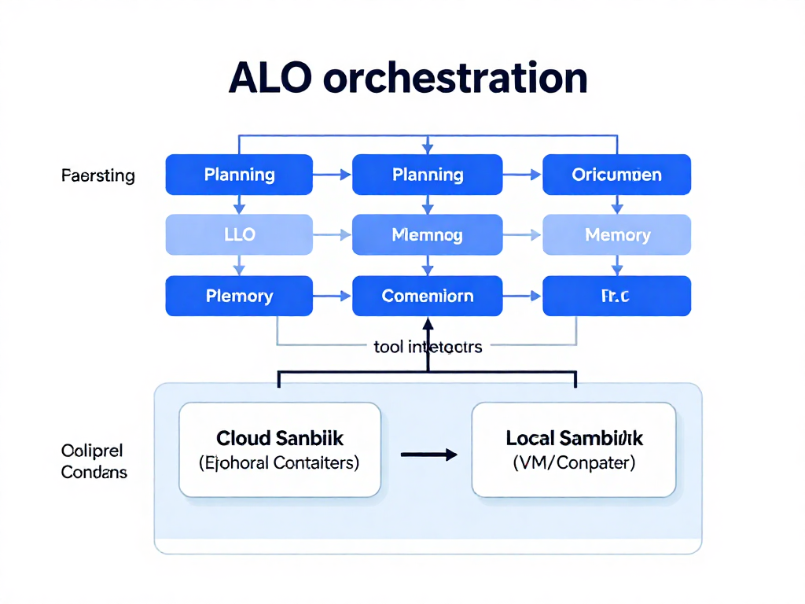
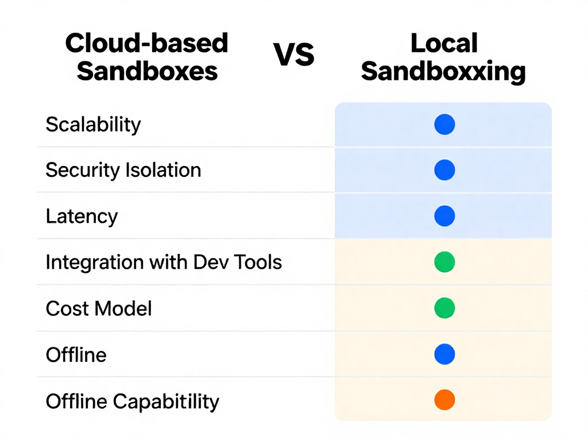

# Cloud vs. Local Sandboxing in AI Coding Agents: Architecture and Trade-offs

## Introduction to Sandboxing in AI Coding Agents

Sandboxing is the practice of creating a controlled, isolated environment for running software, designed to prevent potentially harmful code from affecting the host system or network. In software development and AI coding, sandboxing provides a critical security layer by executing AI-generated code in a separate space where its behavior can be monitored without risking persistent damage or data breaches.

For AI coding agents1tools that generate and test code autonomously1sandboxing ensures that code execution remains safe and contained. This is especially important given the dynamic and sometimes unpredictable nature of AI outputs. Isolation stops malicious or buggy code from interfering with other processes or accessing sensitive resources.

Leading AI coding agents illustrate different sandboxing strategies. Claude Code typically uses cloud-based sandbox environments, benefiting from ephemeral containers that scale with demand and offer strong security isolation. Meanwhile, some OpenAI Codex configurations support local sandboxes, running code securely on the users machine to provide faster feedback loops and offline capabilities.

Understanding these approaches architectures and trade-offs is foundational to designing AI coding workflows that balance security, performance, and developer experience.

## Detailed Architecture of Cloud-Based Sandboxes in AI Agents

Cloud-based sandboxes in AI coding agents, such as those employed by Claude Code, rely fundamentally on ephemeral container technology. These containers are lightweight, isolated runtime environments instantiated on-demand to execute code safely and temporarily. Once the execution completes, the container is destroyed, ensuring that any changes or potential malicious artifacts do not persist beyond the sandbox lifetime. This ephemeral nature is critical for preventing long-term contamination of the host system and enables a clean slate for each execution task ([Source](https://huggingface.co/papers/2604.14228)).

From a scalability standpoint, cloud sandboxes benefit immensely from the elastic infrastructure of cloud platforms. Resources like CPU, memory, and storage can be dynamically allocated to match workload demands, which is vital when handling bursts of multi-user code execution requests or complex computation jobs. This elasticity supports a high degree of parallelism and avoids over-provisioning, which optimizes cost and performance simultaneously. Centralized orchestration services manage container lifecycles and monitor resource consumption across a distributed environment, providing efficient resource management at scale ([Source](https://northflank.com/blog/best-sandboxes-for-coding-agents)).

Security considerations are paramount in cloud sandbox architectures. Isolation through containerization prevents executed code from accessing underlying host resources or other tenant workloads. Combined with network policies and runtime security controls, this setup mitigates risks such as privilege escalation and lateral movement within the cloud environment. The destruction of ephemeral containers removes any residual code artifacts, reducing attack surface over time. Sandboxing frameworks also incorporate advanced monitoring and anomaly detection to quickly surface malicious activities or unintended effects before they impact broader infrastructure or data ([Source](https://www.fortinet.com/resources/cyberglossary/what-is-sandboxing)).

Integration with broader cloud services is another advantage. Cloud sandboxes typically connect seamlessly to logging, authentication, storage, and analytics platforms, enabling centralized monitoring, audit trails, and governance. This integration simplifies compliance and operational oversight while facilitating real-time feedback loops for AI agent improvement and debugging. For example, Claude Codes sandbox environment plugs into cloud-hosted code repositories and continuous integration/continuous deployment (CI/CD) pipelines, allowing AI agents to test code snippets within complete workflows without leaking any state or security context ([Source](https://huggingface.co/papers/2604.14228)).

In summary, cloud-based sandboxes like those used by Claude Code present an architecture that leverages ephemeral containers for secure, scalable, and well-monitored execution of AI-generated code. The combination of isolation, resource elasticity, and deep integration with cloud services provide tangible benefits that are essential for managing the complexity and risks associated with AI coding agents in modern development environments ([Source](https://mightybot.ai/blog/coding-ai-agents-for-accelerating-engineering-workflows/)).

## Local Sandboxing Approaches in AI Coding Agents

Local sandbox environments are isolated execution spaces on the user's machine where AI coding agents can run and test code safely. Unlike cloud-based sandboxes, these environments execute code directly on the local device, typically using containerization (e.g., Docker) or virtual machines to maintain separation from the host systems core processes. This architecture supports AI tools like OpenAI Codex, which in some configurations enable users to verify AI-generated code snippets without leaving their development setup ([MindStudio](https://www.mindstudio.ai/blog/openai-codex-redesign-7-new-features-knowledge-workers/), [InfoQ](https://www.infoq.com/news/2026/02/opanai-codex-app-server/)).

One major benefit of local sandboxes is the reduction of latency. By avoiding round-trip network calls to cloud servers, developers experience near-instant feedback, accelerating debugging and iteration cycles. This immediacy is especially valuable when coding offline or in low-bandwidth environments, where cloud integration may be impractical or impossible. Consequently, local sandboxing tightly integrates into developer workflows by running within familiar IDEs or command-line tools, creating a frictionless environment for testing AI-generated code in real time ([MightyBot](https://mightybot.ai/blog/coding-ai-agents-for-accelerating-engineering-workflows/), [Northflank](https://northflank.com/blog/best-sandboxes-for-coding-agents)).

Common types of local sandboxes used with AI agents include containerized runtimes (Docker or Podman containers), language-specific virtual environments (like Python virtualenvs), and lightweight VMs. These options provide varying degrees of isolation and resource control while maintaining responsiveness to developer commands. For example, containerized sandboxes enable ephemeral testing that wipes state after execution, preventing code persistence or unwanted side effects on the host machine ([Bunnyshell](https://www.bunnyshell.com/guides/coding-agent-sandbox/), [Blaxel](https://blaxel.ai/blog/sandbox-management-for-ai-coding-agents)).

However, local sandboxing does come with important limitations. Security is a critical consideration since the sandbox runs on the users device; misconfigured environments or vulnerabilities in sandbox managers could allow malicious code to escape isolation and affect the host system. Additionally, resource constraints of the local machine (CPU, memory) may limit the complexity or scale of code execution compared to cloud alternatives. Furthermore, managing dependencies and ensuring consistent sandbox setups across different developer environments may introduce overhead ([Fortinet](https://www.fortinet.com/resources/cyberglossary/what-is-sandboxing), [Ry Walker Research](https://rywalker.com/research/ai-agent-sandboxes)).

In summary, local sandboxing offers distinct advantages for AI coding agents by enhancing immediacy, lowering latency, and aligning tightly with developer tools. The trade-offs involve careful attention to security configuration and the practical limits of running code within local hardware and software constraints.

## Comparative Analysis: Cloud vs. Local Sandboxing

When considering sandboxing approaches for AI coding agents, the main trade-offs span performance, security, and usability. Cloud sandboxes provide strong isolation by running code in ephemeral containers, minimizing persistent risks to host systems. They excel in resource management, automatically scaling compute as needed and offering centralized monitoring to detect anomalous behavior or misuse. This centralized model supports comprehensive logging, auditing, and updates, which enhances overall security posture. However, they introduce network latency and require reliable internet access, which might hinder responsiveness for developers with high immediacy demands or intermittent connectivity.

Local sandboxing, conversely, runs code within controlled environments on the users machine. This setup reduces latency and enables offline operation1important for workflows demanding rapid iteration or working behind strict firewalls. It integrates tightly with existing developer tools, allowing seamless transitions between coding, testing, and debugging. Yet, local sandboxes depend on the hosts resource availability and pose a greater security risk if misconfigured or exploited, as sandbox isolation may be weaker than in cloud environments.

Cost and scalability are additional differentiators. Cloud sandboxes typically follow a pay-as-you-go model, making them accessible to teams without upfront infrastructure investment and allowing on-demand scaling for peak workloads. Local sandboxes require investment in hardware and maintenance but eliminate ongoing cloud expenses. For users with constrained budgets or privacy requirements restricting cloud usage, local sandboxing may be preferable.

Consider a distributed team using Claude Code that relies on cloud sandboxes for running user-submitted code snippets securely and scaling automatically with varied demand, ensuring consistent performance without local setup friction. Meanwhile, OpenAI Codex users working on sensitive projects with strict data governance policies might prefer local sandboxing to keep code execution and data within their network perimeter, gaining immediacy and tighter control.

Ultimately, cloud sandboxes stand out for scalable resource management and centralized oversight, while local sandboxes appeal for immediacy and workflow integration. The choice hinges on balancing performance needs, security requirements, cost considerations, and the development environment specifics ([Source](https://huggingface.co/papers/2604.14228), [Source](https://www.mindstudio.ai/blog/local-ai-vs-cloud-ai-what-to-own-vs-rent/)).

## System Architecture Diagram and Explanation for AI Coding Agents

AI coding agents are complex systems that orchestrate multiple functional layers to enable automated code generation, execution, and iterative improvement. A typical architecture consists of four core layers: LLM orchestration, memory layers, tool integrations, and planning modules. Sandboxing environments fit integrally within this architecture to ensure safe and controlled code execution.

### Architecture Layers

- **LLM Orchestration:**  
  This is the central layer where large language models (LLMs) like GPT or Claude are coordinated. The orchestration manages the prompt engineering, model calls, and combining outputs from different model versions or specializations. It serves as the decision-making hub for coding tasks, controlling when and how code is generated or reviewed ([Source](https://huggingface.co/papers/2604.14228)).

- **Memory Layers:**  
  These maintain persistent and context-aware information such as prior code states, user preferences, debugging history, and code repositories. Memory layers enable the AI agent to make contextually relevant decisions and improve interactions over time, enhancing long-term learning and recall.

- **Tool Integrations:**  
  Code editors, compilers, debuggers, version control systems, and sandbox environments are integrated here. Sandboxing is a critical tool integration that isolates code execution, protecting the host system and data. These tools act as controlled execution environments for running, testing, and analyzing AI-generated code ([Source](https://www.bunnyshell.com/guides/coding-agent-sandbox/)).

- **Planning Modules:**  
  Planning is responsible for task decomposition, reasoning over multi-step workflows, and prioritizing subtasks. It can invoke specialized tools or memory modules and decide how to route requests efficiently, often optimizing for resource constraints or user needs ([Source](https://www.augmentcode.com/guides/ai-model-routing-guide)).

### Sandboxing Integration in the Architecture

Sandbox environments execute AI-generated code safely by isolating the runtime from core system components. In the architecture, sandboxes are invoked by tool integrations upon receiving code outputs from the LLM orchestration layer. The sandbox runs the code in an ephemeral environment1either in the cloud or locally1then returns results, logs, and potential errors back to the orchestration layer for further processing.

### Cloud vs Local Sandboxes in the Architecture

- **Cloud Sandboxes:**  
  Agents like Claude Code use cloud-based ephemeral containers, dynamically provisioned on-demand. This approach offers scalable resource management, centralized monitoring, and high security isolation. Integration with cloud services enables seamless access to infrastructure, databases, and advanced tooling without exposing the users environment ([Source](https://www.bunnyshell.com/guides/sandboxed-environments-ai-coding/), [Source](https://www.test-king.com/blog/a-beginners-guide-to-cloud-sandboxes-what-they-are-and-how-they-function/)).

- **Local Sandboxes:**  
  OpenAI Codex configurations sometimes leverage local sandboxing, running and testing code on the user's machine within controlled environments. This reduces latency, preserves offline operation, and better fits existing developer workflows. Local sandboxes typically use lightweight VMs or containers with strict resource and permission limits to safely isolate code execution ([Source](https://mindstudio.ai/blog/local-ai-vs-cloud-ai-what-to-own-vs-rent/), [Source](https://www.mindstudio.ai/blog/openai-codex-redesign-7-new-features-knowledge-workers/)).

### Communication Flow

1. The **LLM orchestration layer** generates code snippets based on user input.
2. Code is sent to the **tool integration layer**, where the sandbox manager determines the execution context.
3. The sandbox environment (cloud or local container) executes the code securely.
4. Execution results and logs are streamed back to the orchestration layer.
5. The **planning module** may re-invoke LLM orchestration with outputs for refinement or next steps.

### Safety, Extensibility, and Maintainability

- **Safety:** Sandboxing is crucial for containing potentially harmful or buggy code. Cloud sandboxes enforce strong multi-tenant isolation, while local sandboxes impose strict limits on resource usage and system access ([Source](https://blaxel.ai/blog/sandbox-management-for-ai-coding-agents)).
- **Extensibility:** Modular architecture allows plugging in new sandbox environments or execution tools without major refactors, supporting evolving hardware, security policies, or user needs.
- **Maintainability:** Separating concerns into orchestration, memory, planning, and tooling layers supports debugging and iterative improvement of individual components, facilitating faster development cycles.

---

*System architecture of AI coding agents illustrating LLM orchestration, memory layers, planning modules, and tool integrations including cloud and local sandbox managers.*

---

**Diagram Caption:** System architecture of AI coding agents illustrating LLM orchestration, memory layers, planning modules, and tool integrations including cloud and local sandbox managers.

---

## Best Practices for Implementing Sandboxing in AI Coding Agents

Strong isolation is critical for sandboxing AI-generated code safely; using microVMs or lightweight containers is highly recommended. MicroVMs provide near-hardware virtualization with minimal overhead, isolating the runtime environment effectively while limiting resource usage. Lightweight containers offer a good balance between isolation and startup speed, enabling fast ephemeral environments that minimize risks to the host system.

Automating the lifecycle and resource management of sandboxes reduces idle costs and improves scalability. Orchestrating sandbox creation, execution, and teardown ensures ephemeral environments do not persist unnecessarily, saving CPU and memory resources. Automated scaling adapts to workload fluctuations, maintaining responsiveness without overprovisioning.

Network isolation policies and controlled API permissions are essential to prevent sandbox escape and data leaks. Restricting outbound communications and limiting accessible system calls reduces attack vectors. Configuring strict API permission scopes lets the sandbox interact only with required tools while preventing unauthorized external access.

Continuous monitoring and logging of sandboxed code execution provide real-time visibility into behavior and potential security threats. Logs enable auditing, anomaly detection, and debugging of issues within the sandbox. Integrating monitoring with alerting systems helps detect suspicious activity or resource exhaustion promptly.

Balancing functional dependencies with security constraints is a practical challenge. Excessive restrictions may hinder code functionality, while lax controls increase risk exposure. Carefully define and regularly review permissions, dependencies, and resource limits tailored to user needs and threat models, adapting as requirements evolve.

Adopting these best practices ensures AI coding agents run code securely and efficiently, whether deploying cloud-based microVM sandboxes or local containerized environments.

## Future Trends and Considerations in Sandboxing for AI Coding Agents

Hybrid sandbox models that combine cloud scalability with local immediacy are emerging as a promising direction. By dynamically allocating execution tasks between cloud-based ephemeral containers and local isolated environments, these hybrids aim to balance resource efficiency, latency, and offline capabilities. This approach could empower AI coding agents to optimize runtime decisions based on task complexity and user context ([Source](https://luiscardoso.dev/blog/sandboxes-for-ai)).

The rapid evolution of AI capabilities is raising the bar for sandbox security. More sophisticated code generation and self-modifying behaviors increase the attack surface, requiring sandbox environments to implement advanced containment mechanisms. Sandboxes must evolve beyond traditional isolation, incorporating behavioral anomaly detection and fine-grained policy enforcement to maintain secure execution without hampering AI agent autonomy ([Source](https://blaxel.ai/blog/sandbox-management-for-ai-coding-agents)).

Regulatory and compliance landscapes are becoming integral factors in sandbox design and deployment. Data privacy laws (such as GDPR or equivalent emerging regulations) and sector-specific standards enforce strict controls over code execution environments, especially when they involve user code, data, or sensitive information. AI coding platforms will need to embed audit trails, access controls, and data handling guarantees within their sandbox infrastructure to meet compliance requirements globally ([Source](https://www.cato.org/blog/digging-ai-sandboxes-benefits-risks-senate-sandbox-act-framework)).

On the technology front, innovative isolation frameworks like Firecracker and gVisor are gaining traction for AI sandboxing. These lightweight virtual machines and container isolation layers offer near-native performance with strong security boundaries, enabling AI agents to safely run untrusted code with less overhead than traditional VMs. Adoption of these technologies promises more resilient and scalable sandboxing solutions tailored for AI workflows ([Source](https://northflank.com/blog/best-sandbox-runners)).

Finally, usability remains a critical concern. Sandboxing strategies must not impede developers productivity or accessibility for end-users. Simplified configuration, transparent sandbox behaviors, and tight integration with existing development tools are vital to ensure sandbox adoption does not add friction. Enhancing visibility into sandbox operations and error handling helps users trust and effectively adopt these safety layers in everyday AI-assisted coding ([Source](https://bunnyshell.com/guides/sandboxed-environments-ai-coding/)).

*Comparison table summarizing key trade-offs between cloud-based and local sandboxing in AI coding agents, highlighting scalability, security, latency, and integration aspects.*

---

**Diagram Caption:** Comparison table summarizing key trade-offs between cloud-based and local sandboxing in AI coding agents, highlighting scalability, security, latency, and integration aspects.

> **[IMAGE GENERATION FAILED]** Communication flow diagram of AI coding agent sandbox integration showing interactions between LLM orchestration, planning modules, tool integrations, and sandbox environments (cloud and local).
>
> **Alt:** Communication flow diagram of AI coding agent sandbox integration
>
> **Prompt:** Create a flow diagram illustrating the communication in AI coding agents between LLM orchestration layer, planning modules, tool integration layer, and sandbox environments (cloud and local). Show arrows indicating the flow of code generation, code execution requests, sandbox execution, and result feedback. Use icons to represent components for clarity.
>
> **Error:** Hugging Face image generation failed. Client path error: Client error '402 Payment Required' for url 'https://router.huggingface.co/fal-ai/fal-ai/z-image/turbo' (Request ID: Root=1-69fae15c-78ecad5b683b283343da2c61;1c8eb1d7-25ad-4882-9ba0-4a8fa9d9ed3f)
For more information check: https://developer.mozilla.org/en-US/docs/Web/HTTP/Status/402

You have depleted your monthly included credits. Purchase pre-paid credits to continue using Inference Providers. Alternatively, subscribe to PRO to get 20x more included usage.. HTTP 400: {"error":"Model not supported by provider hf-inference"}

---

**Diagram Caption:** Communication flow diagram of AI coding agent sandbox integration showing interactions between LLM orchestration, planning modules, tool integrations, and sandbox environments (cloud and local).