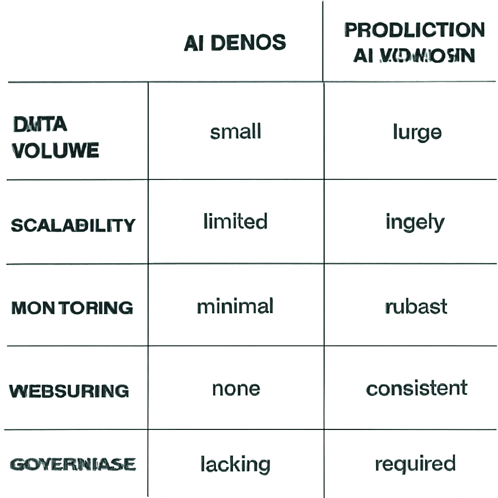
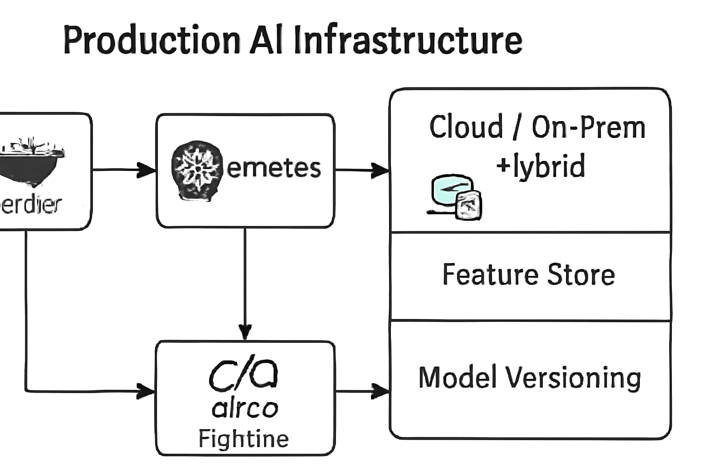

# How to Build Production-Ready AI Systems (Not Just Demos)

## Understand the Key Differences Between AI Demos and Production Systems

AI demos and prototypes typically showcase a model’s core functionality or novel algorithm in a controlled environment. While these demos focus on proof of concept and user experience, production-ready AI systems demand a higher standard of stability, scalability, and reliability to operate at scale in real-world conditions. Unlike demos that often handle limited data and simplified workflows, production systems must manage large volumes of data, integrate with existing infrastructure, and maintain consistent performance 24/7.

A common pitfall when moving AI from demo to production is the lack of comprehensive monitoring and alerting mechanisms. Without effective monitoring, issues such as data drift, model degradation, or infrastructure failures can go unnoticed until they impact end users or business metrics. Scaling is another challenge; many demos run well on a single machine or small dataset but fail to handle load spikes or concurrency demands in production. Overlooking robust versioning and reproducibility further complicates troubleshooting and collaboration, making it hard to track which model or data version is running in production at any time.

Engineering best practices like automated model versioning, end-to-end pipeline reproducibility, and thorough testing protocols are essential to production AI. These practices ensure that models can be reliably updated, rolled back, and audited, which builds trust among stakeholders and supports compliance requirements. For instance, maintaining a clear lineage between training datasets, preprocessing steps, and deployed models prevents discrepancies that could lead to unexpected behavior.

Setting the bar for production readiness involves defining clear service-level objectives (SLOs), establishing failover strategies, and integrating continuous integration/continuous deployment (CI/CD) tailored to AI workflows. Production deployments must also incorporate security measures, audit trails, and governance policies to meet organizational and industry standards. A system that meets these criteria can reliably serve business needs over time without constant firefighting.

Examples of failures due to inadequate production readiness abound. One notable instance involved a financial services firm that deployed a credit risk AI model without proper monitoring and version control. When the underlying customer data distribution shifted during an economic downturn, the model’s accuracy plummeted unnoticed, leading to erroneous loan decisions and significant financial losses. Another common failure mode is scaling bottlenecks resulting in latency spikes or downtime during peak usage, harming user trust and revenue.

Finally, production AI systems require ongoing maintenance that extends beyond the initial deployment. Continuous monitoring for data quality, model performance, and system health is critical. AI governance processes must be in place to manage model retraining cycles, ethical considerations, and compliance audits. This holistic approach ensures the AI system remains effective, fair, and secure as conditions evolve.

In summary, moving from demo to production means shifting from experimental proof of concept to engineering discipline. Recognizing and addressing the stability, scalability, reliability, and governance needs is what differentiates a production-ready AI system from just another demo. This foundational understanding prepares teams to build AI solutions that truly impact business outcomes sustainably and safely.

*Key Differences Between AI Demos and Production-Ready Systems*

## Prepare Your Infrastructure for Production AI Deployment

To build production-ready AI systems, establishing a scalable and maintainable infrastructure is critical. This infrastructure must support consistent execution, facilitate operational agility, and ensure reliable delivery of AI services at scale.

### Containerization for Consistent AI Inference Environments

Containerization technologies like Docker have become foundational for production AI deployments. Containers encapsulate an AI model along with its runtime dependencies, enabling consistent and reproducible environments across development, testing, and production stages. With Docker, AI engineers can package models, libraries, and required software versions into isolated units that run uniformly regardless of underlying host differences or cloud providers. This approach simplifies environment drift issues, accelerates rollout cycles, and reduces "it works on my machine" problems during inference [Source](https://www.redhat.com/en/resources/building-production-ready-ai-environment-ebook).

### Kubernetes Orchestration to Enable Elasticity and Avoid Vendor Lock-In

While containers solve packaging and consistency, managing many containers in production demands orchestration. Kubernetes has emerged as the de facto orchestration platform for AI workloads, offering elasticity through automatic scaling, self-healing, and load balancing. Kubernetes enables you to dynamically allocate compute resources according to inference demand spikes and maintain uptime without manual intervention. Furthermore, deploying Kubernetes clusters both on-premises and across multiple public clouds promotes a hybrid strategy, mitigating risks of vendor lock-in and maximizing infrastructure flexibility in line with evolving business requirements [Source](https://www.ai-agentsplus.com/blog/production-deployment-march-2026).

### Infrastructure Choices: Cloud, On-Premises, or Hybrid Setups

Choosing the right infrastructure setup depends on factors such as data governance, latency sensitivity, cost controls, and compliance requirements. Public clouds provide elastic compute, integrated AI services, and global distribution but may raise concerns for sensitive data or strict regulatory domains. On-premises infrastructure offers direct control and data residency but requires upfront capacity planning and operational overhead. Hybrid models combine the benefits of both by allowing AI workloads to run where most appropriate, orchestrated centrally via Kubernetes or similar platforms. Evaluating workloads, expected scale, and organizational policies will guide the optimal mix for your production AI systems [Source](https://rtslabs.com/enterprise-ai-roadmap/).

### Feature Stores to Manage Data Consistency and Prevent Train-Serve Skew

In production, keeping consistency between features used during model training and inference is paramount to avoid degradation in model performance. Feature stores provide a centralized data infrastructure to store, serve, and share machine learning features. They ensure the same feature computation logic is used both offline (training) and online (serving), thus preventing train-serve skew. By decoupling feature engineering from model lifecycle management, feature stores simplify pipeline automation and improve reproducibility across environments, aligning with modern MLOps practices [Source](https://www.pythian.com/blog/ai-implementation-strategy-the-4-phase-roadmap-to-production-ready-ai).

### Model Versioning, Rollback, and Reproducibility Mechanisms

Production AI systems must support robust model lifecycle management, including versioning, seamless rollbacks, and reproducibility. Versioning allows teams to track model iterations tied to training datasets, code, and hyperparameters. This traceability facilitates audits and debugging when model behavior deviates in production. Rollback procedures enable rapid restoration to a previously validated model if new deployments introduce regressions. Tooling integrations often incorporate experiment tracking alongside CI/CD pipelines to automate reproducible builds and deployments of AI artifacts [Source](https://www.tigeranalytics.com/perspectives/decoding-the-tech/building-a-future-ready-enterprise-a-practical-ai-strategy-for-2026/).

### Infrastructure Monitoring and Automated Deployment Pipelines (CI/CD)

Monitoring infrastructure health, resource utilization, and inference latency is essential for maintaining SLA commitments. Metrics and logs from Kubernetes clusters and AI serving endpoints feed observability dashboards that alert engineers to anomalies before impacting users. In parallel, implementing CI/CD pipelines tailored to AI workloads accelerates safe, repeatable updates. Automated testing, model validation, canary deployments, and gradual rollouts reduce downtime and operational risks. Modern AI production environments increasingly incorporate AI-powered DevOps tools to optimize deployment frequency and system reliability [Source](https://stackgen.com/blog/top-ai-powered-devops-tools-2026).

---
By carefully designing infrastructure with containerization, orchestration, hybrid cloud strategies, feature stores, rigorous versioning, and automation, organizations can transform AI projects from fragile prototypes into dependable production systems ready to meet business demands at scale.

*Core Infrastructure Components for Production AI Systems*

## Implement Robust Data Management and Monitoring Practices

Maintaining high data quality and ensuring consistent model performance are critical challenges when moving AI systems from prototype to production. Among the most common issues are data distribution shifts and the mismatch between batch and real-time data scenarios. Models trained on historical batch data often perform poorly if incoming production data diverges significantly in distribution. Additionally, many production environments require real-time or near-real-time inference pipelines that expose models to data with different characteristics or noise levels compared to offline training data, making data readiness a continuous concern ([AI Agents Plus, 2026](https://www.ai-agentsplus.com/blog/production-deployment-march-2026)).

Setting up continuous data pipelines with integrated validation is foundational to addressing these challenges. Automated workflows should ingest data as it arrives, run validation checks for schema conformity, value ranges, completeness, and consistency, then either flag or reject anomalous data before it reaches the model. Versioned data stores and metadata tracking enable traceability and rollback if needed. Incremental data processing architectures combining batch and streaming techniques have become a best practice to accommodate both historical and real-time data sources while maintaining quality standards ([Nitor Infotech, 2026](https://www.nitorinfotech.com/blog/data-readiness-for-ai-a-2026-framework-for-ai-ready-organizations)).

Model monitoring must go beyond basic accuracy tracking to detect subtle forms of degradation such as concept drift, covariate shift, and label distribution changes. Deploying statistical drift detectors and performance metrics at regular intervals provides early warning signals. Monitoring strategies typically include confusion matrix shifts, prediction distribution changes, and input feature importance shifts. These insights inform maintenance workflows by signaling when retraining or recalibration is required to restore model effectiveness ([Tiger Analytics, 2026](https://www.tigeranalytics.com/perspectives/decoding-the-tech/building-a-future-ready-enterprise-a-practical-ai-strategy-for-2026/)).

Integrating observability into the production stack is vital. Model performance dashboards coupled with automated alerting systems ensure that teams respond promptly to deviations from expected behavior. Retaining feedback loops to enable automated or semi-automated retraining pipelines reduces downtime. For example, configured thresholds on accuracy drop or drift metrics can trigger model version rollouts or human review. Such orchestration ensures continuous model improvement aligned with dynamic data environments ([Pythian, 2026](https://www.pythian.com/blog/ai-implementation-strategy-the-4-phase-roadmap-to-production-ready-ai)).

Several modern tools and frameworks support this comprehensive observability. Open-source platforms like Evidently AI and Fiddler AI specialize in model monitoring and data drift detection. Cloud providers and MLops platforms such as MLflow and Seldon Deploy offer integrated monitoring for data pipelines and model scoring metrics. Utilizing these tools aids in logging inference inputs and outputs, generating drift reports, and visualizing trends over time, empowering fluent collaboration between data scientists, engineers, and business stakeholders ([SiliconFlow, 2026](https://www.siliconflow.com/articles/en/the-best-open-source-AI-deployment-tools)).

Monitoring is not just a technical requirement but a compliance imperative. Industries governed by AI regulations—such as finance, healthcare, and manufacturing—must demonstrate transparency and accountability in AI operations. Continuous monitoring helps maintain audit trails for data usage, performance consistency, and fairness checks, assisting organizations in meeting ethical AI standards and regulatory mandates. Embedding monitoring data into governance workflows enables proactive risk management and adherence to evolving AI policies in 2026 and beyond ([Glean, 2026](https://www.glean.com/perspectives/top-7-industries-with-stringent-ai-compliance-needs-in-2026); [SentinelOne, 2026](https://www.sentinelone.com/cybersecurity-101/data-and-ai/ai-security-standards/)).

By establishing end-to-end data validation, continuous model performance monitoring, and observability practices tightly integrated with alerts and retraining procedures, AI teams can build resilient production systems that not only perform well initially but remain reliable and compliant over time.

## Adopt Advanced AI Deployment Patterns and DevOps Practices

Deploying AI models into production requires strategies that balance innovation with operational stability. Advanced deployment patterns like Blue-Green Deployments and Canary Releases offer controlled rollouts that mitigate risks while enabling rapid iteration. Blue-Green Deployment involves maintaining two identical environments—Blue and Green—where one serves live traffic while the other hosts the new version. You switch traffic to the Green environment once validated, enabling near-instant rollback if issues arise. Canary Releases gradually direct a small portion of traffic to the new version to monitor performance and user impact before full rollout. Both patterns reduce downtime and exposure to faulty models, essential for production AI systems with real user impact ([Source](https://www.ai-agentsplus.com/blog/production-deployment-march-2026)).

Separating deployment from release is another crucial practice. This approach means the AI model and associated code are deployed in a dormant state, and features are turned on via configuration or feature flags only when ready. It allows teams to deploy frequently without exposing unfinished or experimental models to end users, enabling safer experimentation, rollback, and incremental feature introduction. By decoupling deployment from release, AI teams gain greater control over performance impacts and user experience adjustments without complex redeployments ([Source](https://www.redhat.com/en/resources/building-production-ready-ai-environment-ebook)).

Agent-based AI represents a new frontier in integrating AI within production workflows. These autonomous or semi-autonomous AI agents perform tasks such as data preprocessing, model monitoring, anomaly detection, or even coordinating multi-model ensembles. Incorporating agent frameworks streamlines complex AI workflows by distributing responsibilities across specialized intelligent components. Modern AI agent frameworks—such as LangChain and AgentGPT—offer APIs to manage these workflows, making them production-ready for real-time decision systems and self-healing pipelines ([Source](https://pub.towardsai.net/top-ai-agent-frameworks-in-2026-a-production-ready-comparison-7ba5e39ad56d)). With agents, organizations can build scalable, maintainable AI operations that evolve with minimal human intervention while retaining safeguards.

AI-powered DevOps tools are transforming how infrastructure and CI/CD pipelines are managed in AI projects. These tools apply machine learning techniques to automate infrastructure drift detection, predict deployment failures, and optimize pipeline execution speeds. Some prominent platforms provide automated tuning of hyperparameters in training pipelines and adaptive resource allocation based on workload characteristics. Incorporating AI-driven analytics into DevOps workflows enhances visibility and responsiveness, leading to increased reliability and reduced manual toil. This next-gen tooling fits well with continuous experimentation and deployment practices demanded by production AI workloads ([Source](https://stackgen.com/blog/top-ai-powered-devops-tools-2026)).

Human-in-the-loop (HITL) approaches are essential to maintain oversight of AI systems, ensuring outputs remain aligned with business goals and ethical standards. Despite automation, human reviewers intervene in cases of uncertainty, model drift, or flagged anomalies, providing feedback that improves model quality over time. HITL not only mitigates risk but also accelerates AI learning cycles via curated input. Integrating HITL in production pipelines preserves control and accountability while allowing AI to handle routine tasks, striking a balance between scale and governance ([Source](https://rtslabs.com/enterprise-ai-roadmap/)).

For continuous integration and delivery (CI/CD) specific to AI workloads, best practices include:

- **Modular pipeline design**, separating data ingestion, model training, evaluation, and deployment steps for reusability and clarity.

- **Automated data validation**, ensuring data quality before triggering model retraining.

- **Robust versioning** of data, code, and models to facilitate traceability and rollback.

- **Performance and fairness testing** incorporated as regular gating criteria in CI workflows.

- **Incremental model updates**, using techniques such as transfer learning or ensemble updates to reduce retraining overhead.

- **Monitoring and alerting integration** post-deployment to detect model decay and trigger automated pipeline adjustments ([Source](https://www.pythian.com/blog/ai-implementation-strategy-the-4-phase-roadmap-to-production-ready-ai)).

Adopting these deployment and DevOps strategies strengthens the foundation for AI systems that can scale responsibly and adapt swiftly in production environments, moving far beyond proof-of-concept demos into business-critical operational tools.

## Build a Skilled and Collaborative AI Production Team

Building production-ready AI systems requires more than just cutting-edge models—it demands a team with diverse expertise, clear governance, and ongoing collaboration across roles. Key roles to assemble include ML engineers who develop and tune models; data engineers who ensure quality and accessible data pipelines; DevOps professionals who automate deployment and monitor systems; QA specialists who rigorously validate model behavior; and business stakeholders who align AI outputs with organizational objectives and compliance needs [Source](https://www.ai-agentsplus.com/blog/production-deployment-march-2026).

Investing in continuous training and upskilling is critical as AI infrastructure and governance evolve rapidly. Teams must stay updated on emerging tools and frameworks that facilitate scalable, secure deployments. For example, understanding containerization, model versioning, and monitoring platforms is increasingly essential for ML engineers and DevOps alike [Source](https://www.redhat.com/en/resources/building-production-ready-ai-environment-ebook). Simultaneously, cultivating knowledge of AI risk factors—such as bias, privacy, and explainability—empowers all team members to uphold ethical standards.

AI governance frameworks are now fundamental pillars in production AI. These frameworks define processes to identify and mitigate ethical risks, ensure regulatory compliance, and foster transparency. For instance, bias detection protocols, data privacy safeguards, and audit trails for model decisions help build trust and reduce operational risk [Source](https://www.sentinelone.com/cybersecurity-101/data-and-ai/ai-security-standards/). Governance is not a one-time checklist but an integral, iterative function embedded in the AI lifecycle.

Effective production AI demands continuous collaboration between data scientists, engineers, and business analysts. This cross-functional synergy accelerates troubleshooting, aligns model outputs with business needs, and drives iterative improvements based on real-world feedback [Source](https://www.tigeranalytics.com/perspectives/decoding-the-tech/building-a-future-ready-enterprise-a-practical-ai-strategy-for-2026/). Collaborative tools and shared metrics foster a common language and goal orientation across teams.

Empirical evidence suggests allocating the majority of AI budgets to talent yields the highest ROI for sustainable AI production systems. Investing in people—hiring specialized roles, enabling ongoing education, and supporting collaboration—outweighs focusing solely on technology infrastructure or prototyping tools [Source](https://rtslabs.com/enterprise-ai-roadmap/). Hiring excellent engineers and embedding governance specialists early significantly reduce costly rework and compliance pitfalls.

Finally, establishing measurable KPIs that encompass both AI technical performance and business impact is crucial. Metrics such as prediction accuracy, latency, fairness indices, user engagement, and revenue uplift provide actionable insights to steer AI operations and prove value to stakeholders [Source](https://www.pythian.com/blog/ai-implementation-strategy-the-4-phase-roadmap-to-production-ready-ai). These KPIs facilitate data-driven decisions and continuous optimization aligned with enterprise goals.

By focusing on building a well-rounded, knowledgeable, and collaborative AI team supported by strong governance and metrics, organizations lay the foundation for production AI systems that deliver real-world value consistently and responsibly.

## Leverage Cutting-Edge AI Agent Frameworks and Open-Source Tools for Production

Building AI systems that move beyond demos to robust production deployments requires choosing frameworks and tools designed for real-world scale, observability, and compliance. In 2026, several AI agent frameworks and open-source platforms have emerged as leaders by providing comprehensive production-ready features.

### Leading AI Agent Frameworks and Their Production Capabilities

- **LangGraph** stands out for its graph-based orchestration of AI agents, enabling highly composable workflows that simplify complex task automation while maintaining traceability for debugging and auditing. It supports distributed execution and integrates natively with cloud monitoring systems for observability.

- **AutoGen/AG2** focuses on agent collaboration and autonomous problem solving. It includes built-in lifecycle management and resource optimization capabilities to reduce operational costs, along with compliance tools for data privacy and model governance.

- **Semantic Kernel** from Microsoft offers a modular architecture that facilitates integration with existing enterprise services. It emphasizes extensibility and production monitoring, including real-time telemetry dashboards and alerting.

- **LlamaIndex** specializes in AI data indexing and retrieval at scale, enhancing inference speed and accuracy in production environments. Its open-source nature allows customization for industry-specific compliance and auditing requirements.

Each of these frameworks addresses production needs like scalability, error handling, and cost control, making them suitable beyond prototype stages ([Source](https://pub.towardsai.net/top-ai-agent-frameworks-in-2026-a-production-ready-comparison-7ba5e39ad56d)).

### Open-Source Platforms for Scalable AI Inference and Fine-Tuning

- **SiliconFlow** offers a highly scalable framework optimized for deploying AI models with efficient resource allocation. Its pipeline supports both inference and continuous fine-tuning workflows, with built-in observability to measure latency and throughput metrics accurately.

- **Hugging Face** continues to be a leading platform with extensive community models and tooling. Their open-source inference server supports multi-framework deployment and integrates with MLOps pipelines, helping teams fine-tune models safely in production.

- **Seldon** provides an enterprise-grade open-source platform focusing on containerized AI serving. It offers features like canary deployments, A/B testing, and elaborate monitoring to minimize downtime and optimize performance under load ([Source](https://www.siliconflow.com/articles/en/the-best-open-source-AI-deployment-tools)).

### Enhancing Observability, Composability, and Cost Efficiency

These frameworks and tools bring significant advances in:

- **Observability:** Integrated telemetry, logging, and alerting systems enable you to monitor AI workflows end-to-end. This reduces mean time to resolution (MTTR) for failures and simplifies compliance reporting.

- **Composability:** Modular design and native support for chaining AI agents allow building complex workflows that are easy to maintain and evolve.

- **Cost Efficiency:** Features like adaptive resource scaling, lifecycle-based resource cleanup, and fine-grained usage metrics help control cloud expenses and optimize inference costs ([Source](https://www.ai-agentsplus.com/blog/production-deployment-march-2026)).

### Framework Comparison: Compliance Readiness, Deployment Maturity, Integration Flexibility

| Framework/Tool | Compliance Readiness | Deployment Maturity           | Integration Flexibility                    |
|----------------|---------------------|------------------------------|--------------------------------------------|
| LangGraph      | Strong audit trails and data lineage support | Mature with production orchestration | Supports REST APIs, cloud-native workflows |
| AutoGen/AG2    | Built-in governance and privacy controls       | Early but rapidly maturing             | SDK support for Python, Java                 |
| Semantic Kernel| Enterprise-focused with telemetry compliance   | Stable and widely adopted               | Integrates with Azure and other cloud APIs  |
| LlamaIndex    | Customizable for industry-specific compliance  | Actively developed, community driven   | Language-agnostic APIs                        |
| SiliconFlow   | Compliance via pipeline auditability            | Production-ready with fine-tuning      | Kubernetes native, CI/CD integration          |
| Hugging Face  | Model governance and licensing                   | Highly mature ecosystem                  | Multi-framework support, MLOps ready          |
| Seldon        | Supports GDPR, HIPAA via deployment configs     | Enterprise-grade with scalable serving  | Strong Kubernetes and cloud platform support  |

### Tips for Selecting the Right Framework or Tool

- **Match to Use Case Complexity:** Choose composable frameworks like LangGraph for multi-agent orchestration; prefer specialized tools like LlamaIndex for large-scale data retrieval.

- **Compliance Requirements:** Enterprises in regulated sectors should prioritize frameworks or tools with built-in audit and privacy features such as AutoGen/AG2 or Semantic Kernel.

- **Deployment Environment:** Consider container-native and Kubernetes-friendly platforms like Seldon and SiliconFlow for cloud scalability.

- **Community and Ecosystem:** Favor tools with active open-source communities to benefit from rapid bug fixes, feature updates, and integration plugins, reducing vendor lock-in risks.

- **Cost Constraints:** Look for solutions offering adaptive scaling and resource management to keep running costs manageable.

### Embracing Community-Supported Tools to Accelerate Production Readiness

Active community engagement accelerates production adoption by rapidly addressing edge cases, security patches, and integration needs. Open-source frameworks backed by large ecosystems, such as Hugging Face and LangGraph, empower teams to innovate faster while avoiding vendor lock-in. This dynamic encourages sharing best practices and contributes to evolving standards around AI deployment, observability, and compliance ([Source](https://www.redhat.com/en/resources/building-production-ready-ai-environment-ebook)).

By thoughtfully selecting and combining these leading AI agent frameworks and open-source deployment platforms, AI teams can transition from proof-of-concept demos to scalable, maintainable, and compliant production systems in 2026 and beyond.

## Address Common Challenges in Scaling AI Systems to Production

Scaling AI systems from prototypes to production-ready solutions involves navigating a complex landscape of technical, organizational, and regulatory hurdles. Common challenges include unclear ROI, resistance to change within teams, fragmented data sources, and high infrastructure costs. These obstacles can stall progress or lead to costly failures if not addressed early.

### Navigating Budget and Adoption Barriers

Uncertain return on investment (ROI) often makes securing sustained funding difficult. To address this, adopt a phased budgeting approach that aligns financial commitments with project milestones. Beginning with low-risk pilot projects allows teams to demonstrate value quickly, building stakeholder confidence for larger-scale investments. Additionally, employing managed cloud services and carefully selected open-source tools can reduce upfront infrastructure and maintenance expenses, avoiding over-provisioning during early stages [Source](https://www.ai-agentsplus.com/blog/production-deployment-march-2026).

Resistance to change is equally critical. Encouraging cross-functional collaboration, involving business and operational teams in early AI development phases, helps integrate AI initiatives into broader organizational workflows. Transparent communication about AI’s benefits and potential impact mitigates fear and builds trust.

### Governance and Compliance as Pillars of Production Readiness

Comprehensive governance frameworks are vital to mitigate risks related to privacy, ethics, and regulatory compliance. This includes defining clear policies for data usage, model explainability, and audit trails. Proactive governance also addresses emerging standards in AI security and industry-specific compliance mandates, which have gained prominence in 2026 for sectors like finance and healthcare [Source](https://www.glean.com/perspectives/top-7-industries-with-stringent-ai-compliance-needs-in-2026).

Regular monitoring enables early detection of model degradation, data drift, and infrastructure failures. This proactive observability approach emphasizes continuous health checks through metrics and alerting pipelines—ensuring issues are resolved before impacting end users [Source](https://www.redhat.com/en/resources/building-production-ready-ai-environment-ebook).

### Bridging Experimentation and Operational Stability

Moving beyond experimentation requires institutionalizing best practices such as version control for models and data sets, automated testing pipelines, and reproducible builds. These practices reduce manual errors and accelerate feedback loops, crucial to production stability. Integration with legacy systems is another area where careful planning pays off, leveraging APIs and middleware to enable interoperability while minimizing disruption [Source](https://www.tigeranalytics.com/perspectives/decoding-the-tech/building-a-future-ready-enterprise-a-practical-ai-strategy-for-2026/).

Data quality issues remain a persistent bottleneck. Implementing standardized data validation and cleansing workflows improves input reliability, directly boosting model performance. Addressing talent shortages through cross-training existing staff, and deploying AI-powered DevOps tools can augment capacity to manage complex AI systems at scale [Source](https://stackgen.com/blog/top-ai-powered-devops-tools-2026).

### Summary of Practical Solutions

- Use phased budgeting and pilot projects to validate ROI early and ensure controlled scaling.
- Employ managed cloud services and vetted open-source tools to optimize infrastructure costs.
- Build robust governance frameworks covering ethics, privacy, and compliance with ongoing monitoring.
- Institutionalize enterprise-grade workflows: version control, automated testing, and reproducibility.
- Address data fragmentation with standardized pipelines and quality checks.
- Mitigate talent gaps through training and AI-augmented tooling.
- Plan carefully for legacy system integration via APIs and middleware bridges.

By anticipating these challenges and applying pragmatic solutions, organizations position their AI initiatives for smooth transition from promising prototypes to production-grade systems that deliver sustainable business value.

[Production AI Deployment Strategies Guide 2026 | AI Agents Plus](https://www.ai-agentsplus.com/blog/production-deployment-march-2026)  
[Top considerations for building a production-ready AI environment | RedHat](https://www.redhat.com/en/resources/building-production-ready-ai-environment-ebook)  
[Building a Future-Ready Enterprise AI Strategy for 2026 | Tiger Analytics](https://www.tigeranalytics.com/perspectives/decoding-the-tech/building-a-future-ready-enterprise-a-practical-ai-strategy-for-2026/)  
[Top AI-Powered DevOps Tools for 2026 | StackGen](https://stackgen.com/blog/top-ai-powered-devops-tools-2026)  
[Top 7 industries with stringent AI compliance needs in 2026 | Glean](https://www.glean.com/perspectives/top-7-industries-with-stringent-ai-compliance-needs-in-2026)

## Plan for Continuous Improvement and Future-Proofing of AI Systems

Building production-ready AI systems is not a one-time effort; it requires ongoing attention to keep models effective, relevant, and compliant after deployment. Continuous monitoring is essential to detect performance drifts caused by changing data distributions, external environment shifts, or evolving user behavior. Regular retraining with fresh data and updates to the underlying environment—including dependencies and infrastructure—are critical to maintaining system accuracy and reliability over time ([AI Agents Plus, 2026](https://www.ai-agentsplus.com/blog/production-deployment-march-2026)).

Preparing for emerging AI paradigms such as agentic AI—autonomous systems capable of proactive decision-making—and multi-model architectures is increasingly important. These approaches enable richer capabilities by combining complementary models or allowing AI agents to self-direct tasks. Designing systems that can integrate these evolving technologies helps future-proof AI investments. Staying informed about leading AI agent frameworks and deployment tools of 2026 supports strategic adaptation ([Towards AI, 2026](https://pub.towardsai.net/top-ai-agent-frameworks-in-2026-a-production-ready-comparison-7ba5e39ad56d)).

Implementing robust feedback loops is crucial for continuous system improvement. This includes structured mechanisms for gathering direct user feedback and employing automated telemetry pipelines that capture operational metrics and error conditions in real time. Such feedback enables rapid detection of issues and drives informed model updates, ultimately enhancing user trust and business value ([Red Hat, 2026](https://www.redhat.com/en/resources/building-production-ready-ai-environment-ebook)).

Scalable architecture designs are foundational for accommodating future growth and complexity. Systems built on modular, cloud-native, and containerized components allow easy scaling, integration of new features, and parallel experimentation without disruptions to production workflows. This architectural foresight reduces technical debt and shortens time-to-market for subsequent improvements ([Tiger Analytics, 2026](https://www.tigeranalytics.com/perspectives/decoding-the-tech/building-a-future-ready-enterprise-a-practical-ai-strategy-for-2026/)).

Compliance and governance standards around data privacy, security, and ethical AI practices continue to evolve rapidly. Staying abreast of updated regulations—such as sector-specific AI compliance frameworks—is necessary to avoid legal risks and maintain stakeholder confidence. Proactive compliance planning should be baked into the deployment lifecycle, including regular audits and update cycles to policies and controls ([Glean, 2026](https://www.glean.com/perspectives/top-7-industries-with-stringent-ai-compliance-needs-in-2026)).

Finally, investing strategically in AI infrastructure and team readiness forms the backbone of sustainable AI operations. This includes allocating resources for continuous training, tooling upgrades, and hiring or upskilling talent with expertise in AI monitoring, MLOps, and emerging AI disciplines. Such investments ensure organizations remain agile and capable of scaling AI impact over the long term ([Pythian, 2026](https://www.pythian.com/blog/ai-implementation-strategy-the-4-phase-roadmap-to-production-ready-ai)).

In sum, continuous improvement combined with thoughtful future-proofing practices empowers AI teams to maintain production readiness and capitalize on the innovations shaping AI's next phase.
