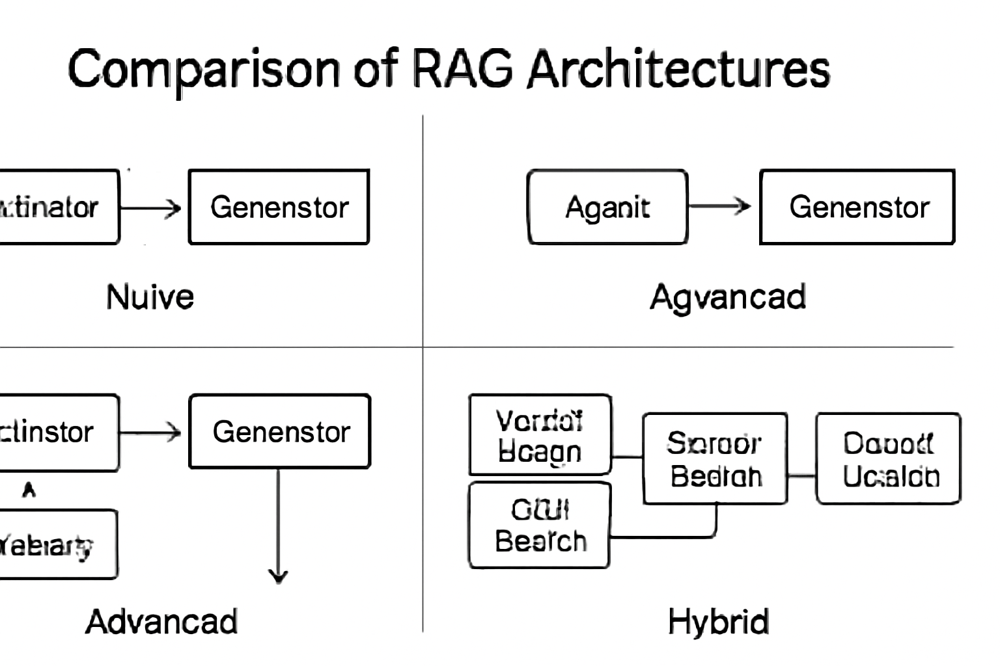
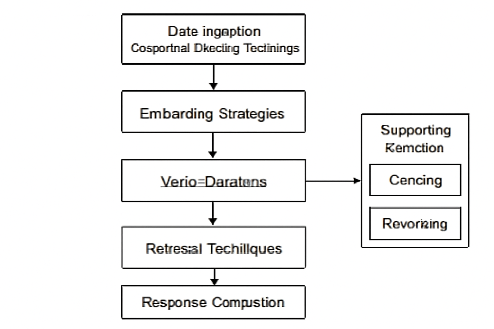
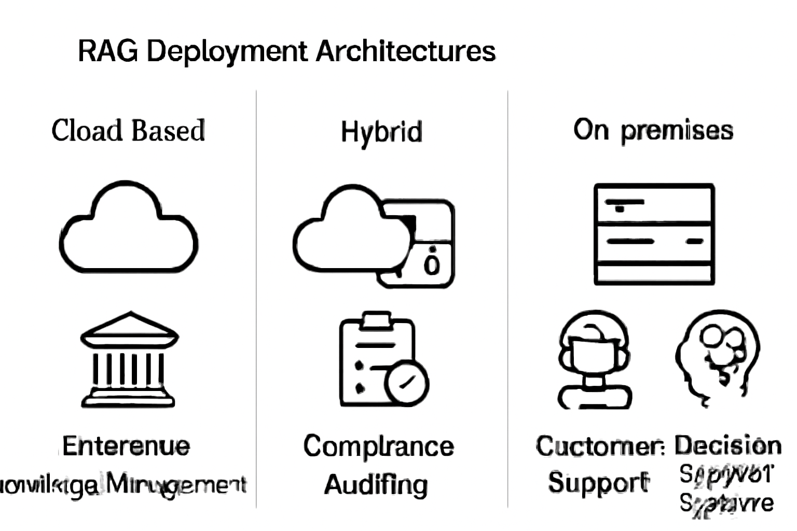

# Mastering Retrieval-Augmented Generation (RAG): An End-to-End Guide for 2026

## Introduction to Retrieval-Augmented Generation (RAG) and Its Benefits

Retrieval-Augmented Generation (RAG) is an approach that combines two powerful AI paradigms: information retrieval and natural language generation. At its core, RAG enhances large language models (LLMs) by integrating external knowledge sources through retrieval mechanisms before generating a response. Instead of relying solely on pre-trained internal knowledge, RAG dynamically fetches relevant documents, passages, or data snippets from an external corpus, which then condition or inform the generative output. This fusion leads to responses grounded in real-time, specific knowledge rather than only statistical language patterns.

One primary benefit of RAG is its ability to **reduce hallucinations**—the generation of incorrect or fabricated facts—frequently seen in standalone LLMs. By grounding generation with retrieved context, RAG models produce more accurate and verifiable outputs. Additionally, RAG significantly **improves domain adaptivity**: developers can tailor the retrieval database to any specific enterprise domain, industry, or knowledge base, enabling the model to respond with authoritative, specialized information without retraining the whole LLM. Another critical advantage is RAG’s capability to **support up-to-date knowledge**, since retrieval can tap into continuously updated data repositories, addressing LLMs' static training cutoffs.

RAG effectively acts as a bridge that connects organizational knowledge bases—such as internal documents, FAQs, regulatory guidelines, or dynamic datasets—with generative AI systems. By doing so, it empowers solutions that safely and confidently deploy LLMs into sensitive or regulated enterprise workflows, where accuracy, auditability, and compliance are paramount. Moreover, RAG is essential for **dynamic content generation scenarios** like personalized customer interactions, adaptive learning platforms, or research assistance, where responses must reflect both context and the latest information.

In summary, RAG’s combination of retrieval and generation extends the capabilities of LLMs, enabling AI systems that are more reliable, customizable, and current—qualities crucial for production-grade applications in 2026 and beyond.  
[Source](https://squirro.com/squirro-blog/state-of-rag-genai) | [Source](https://www.techment.com/blogs/rag-architectures-enterprise-use-cases-2026/)

## Overview of RAG Architectures: Naive, Advanced, Agentic, and Hybrid

Retrieval-Augmented Generation (RAG) architectures in 2026 have evolved into distinct categories, each suited for different complexity levels and enterprise needs. Understanding these architectures helps in selecting the right approach for your use case and optimizing outcomes.

### Naive RAG: The Basic Retrieval-Then-Generate Pipeline

Naive RAG represents the foundational approach, where a retrieval module fetches relevant documents or knowledge snippets from a vector store or knowledge base, and a generator (typically a large language model) produces a response conditioned on this retrieved data. This single-step retrieval and generation pipeline is straightforward to implement and offers a direct method to improve generation accuracy by grounding on external knowledge. However, it may struggle with noisy retrievals and lacks refinement or multi-hop reasoning capabilities. Naive RAG is practical for simpler Q&A systems or prototypes where interpretability and speed take precedence over deep contextual understanding ([Source](https://dev.to/suraj_khaitan_f893c243958/-rag-in-2026-a-practical-blueprint-for-retrieval-augmented-generation-16pp)).

### Advanced RAG: Incorporating Augmentation Modules for Greater Precision

Advanced RAG architectures build on the naive pipeline by integrating augmentation layers such as reranking, multi-step retrieval, and memory components. Reranking modules reorder retrieved documents based on relevance signals to improve the generator’s input quality. Multi-step retrieval enables iterative querying where intermediate retrieval outcomes guide subsequent searches, facilitating better context exploration. Memory modules store intermediate states or user interactions to maintain context over time, enabling long-running and personalized sessions. This architecture increases accuracy and supports complex queries, making it suitable for customer support, technical documentation search, or knowledge-intensive workflows ([Source](https://neo4j.com/blog/genai/advanced-rag-techniques/)).

### Agentic RAG: Interactive Agents Using Tools and Workflows

Agentic RAG introduces interactive agents that orchestrate retrieval and generation with tool usage and workflow automation. These agents combine various retrieval methods with action modules such as calculators, code execution environments, or external knowledge APIs to perform multi-modal retrieval and enhanced generation. This agent-driven paradigm supports sophisticated applications like virtual assistants, research aides, or enterprise automation bots which require dynamic decision-making and tool integration. Agentic RAG leverages natural language understanding to invoke appropriate subroutines, enabling richer interactivity and flexibility beyond text-only generation ([Source](https://arxiv.org/abs/2603.07379)).

### Hybrid RAG: Combining Vector, Sparse, Graph, and SQL Searches

Hybrid RAG architectures unify multiple retrieval techniques to maximize precision and adaptability. They blend dense vector search with traditional sparse retrieval (like BM25), graph-based knowledge traversals, and structured SQL database queries. This fusion addresses the limitations of any single retrieval method and supports enterprise-scale knowledge bases containing heterogeneous data types. For example, graph search excels at relationship exploration, while vector search captures semantic similarity. Hybrid RAG is ideal for complex analytical use cases, regulatory compliance systems, or multi-domain knowledge management where flexibility and accuracy are critical ([Source](https://www.techment.com/blogs/rag-architectures-enterprise-use-cases-2026/)).

### Choosing the Right Architecture for Enterprise Use

- **Naive RAG** fits scenarios requiring rapid deployment with minimal complexity, such as FAQ bots or simple document retrieval.
- **Advanced RAG** is preferred for domains with complex queries needing iterative refinement, including customer service or internal knowledge mining.
- **Agentic RAG** excels in interactive environments where multi-modal inputs and tool collaboration enable richer user experiences.
- **Hybrid RAG** is best suited for enterprises managing diverse data sources and requiring precision across structured and unstructured data.

Selecting the appropriate RAG architecture depends on balancing factors such as query complexity, real-time responsiveness, interoperability needs, and integration with existing enterprise infrastructure ([Source](https://squirro.com/squirro-blog/state-of-rag-genai)).


*Overview of RAG architectures illustrating their components and workflow complexity.*

## Key Components of a RAG System

Constructing a high-performance Retrieval-Augmented Generation (RAG) system hinges on orchestrating several critical components that work together to ingest, process, retrieve, and generate contextually relevant information. Each element plays a pivotal role in ensuring accurate, efficient, and scalable responses. Below is an in-depth look at these components and best practices for their implementation in 2026.

### Data Ingestion

The foundation of any RAG system is high-quality data from diverse sources such as documents, web pages, databases, APIs, and proprietary knowledge bases. The data ingestion pipeline must support:

- **Collection**: Integrate connectors for various data sources, ensuring continuous updates to maintain freshness.
- **Cleaning**: Apply systematic preprocessing such as removing noise, correcting errors, and normalizing formats.
- **Chunking**: Split large texts into meaningful segments (e.g., paragraphs or topical units) to optimize embedding granularity and retrieval relevance.
- **Preparation**: Metadata tagging and formatting to enable efficient indexing and retrieval downstream.

Robust ingestion pipelines incorporate automated workflows and monitoring to detect and handle data quality issues early[Source](https://www.informatica.com/resources/articles/enterprise-rag-data-ingestion.html),[Source](https://www.linkedin.com/posts/sukanyakansari_understanding-data-ingestion-in-rag-data-activity-7413225476049043458-kFV4).

### Embedding Strategies

Embeddings transform textual data into dense vector representations that capture semantic meaning. Selecting an effective embedding approach involves:

- **Model Choice**: Common embedding models in 2026 range from transformer-based encoders fine-tuned on domain-specific corpora to specialized sentence or paragraph embedding models.
- **Joint vs. Separate Embeddings**: Decide if query and document embeddings share the same model or are optimized separately to maximize retrieval accuracy.
- **Dimension & Normalization**: Balance vector dimensionality to ensure expressiveness without excessive storage/computation costs, applying normalization to improve similarity computations.

Generating embeddings in batches with parallelism and caching intermediate results enhances throughput and reduces latency[Source](https://www.stackai.com/insights/best-embedding-models-for-rag-in-2026-a-comparison-guide),[Source](https://learn.microsoft.com/en-us/azure/architecture/ai-ml/guide/rag/rag-generate-embeddings).

### Vector Databases

Vector databases store and index large collections of embeddings, enabling fast similarity searches. Key considerations include:

- **Storage & Scaling**: Choose databases that handle billions of vectors with distributed architectures.
- **Indexing Techniques**: Algorithms like Hierarchical Navigable Small World graphs (HNSW), Flat, or IVF-PQ balance search accuracy and speed.
- **Similarity Metrics**: Support cosine similarity, dot product, or others depending on embedding characteristics.
- **Integration**: Seamless APIs and SDKs for embedding ingestion, query interface, and metadata filtering.

Top vector databases in 2026 offer modular architectures for customizable indexing and retrieval methods, enabling deployment flexibility for various workloads[Source](https://alphacorp.ai/blog/best-vector-databases-for-rag-2026-top-7-picks),[Source](https://www.firecrawl.dev/blog/best-vector-databases).

### Retrieval Techniques

The retrieval component bridges queries to relevant knowledge by:

- **Semantic Similarity Search**: Using embeddings to find documents whose vectors lie closest to the query embedding. This allows natural language matching beyond keyword overlap.
- **Hybrid Retrieval Approaches**: Combine semantic search with traditional lexical retrieval (e.g., BM25) to capture both term-based and contextual relevance signals. These hybrid methods improve precision and recall.
- **Filtering & Reranking**: Apply domain or metadata filters before reranking results using additional scoring models or cross-encoders to refine selection.

Employing hybrid and reranking methods ensures higher fidelity retrieval results, which is critical as datasets scale[Source](https://neo4j.com/blog/genai/advanced-rag-techniques/),[Source](https://www.meilisearch.com/blog/rag-techniques).

### Response Generation

The generative model consumes retrieved data to produce contextually rich and informative outputs:

- **Prompt Construction**: Design prompts that clearly incorporate retrieved chunks while allowing the LLM to reason effectively. Prompts typically concatenate retrieved text snippets, optionally augmented with instructions or task context.
- **Chunk Selection & Ordering**: Select top-k relevant chunks and order them by relevance or recency to maintain coherence and avoid information overload.
- **Generation Control**: Use techniques such as prompt priming, temperature tuning, and maximum token limits to balance creativity and factuality.

Optimized prompt strategies enable LLMs to accurately ground generation on retrieved knowledge, improving answer specificity and trustworthiness[Source](https://squirro.com/squirro-blog/state-of-rag-genai).

### Supporting Components

Beyond the core blocks, several supporting modules further enhance RAG system performance:

- **Caching**: Store embeddings or retrieval results for frequent queries to reduce latency and computational overhead.
- **Query Expansion**: Automatically augment queries with synonyms, related terms, or contextual annotations to improve retrieval recall.
- **Reranking Modules**: Leverage lightweight models or cross-encoders to reorder candidate documents post initial retrieval for better relevance.

Implementing these optimizations improves scalability, reduces response times, and enhances overall user experience[Source](https://arxiv.org/html/2506.03401v1),[Source](https://www.meilisearch.com/blog/rag-techniques).

---

Combined, these components provide a tightly integrated pipeline from raw data to intelligent, grounded generation. Thoughtful design of each layer and their interactions is critical for building practical and deployable RAG systems in 2026.

## Step-by-Step Implementation of a Basic RAG Pipeline

Building a Retrieval-Augmented Generation (RAG) pipeline involves multiple stages where we ingest data, generate embeddings, index them for efficient retrieval, query the vector database, and finally synthesize responses using a large language model (LLM). This section guides you through these essential steps, with actionable instructions and examples using 2026-recommended tools and models.

### 1. Set Up Data Ingestion Pipeline

Start by collecting and preparing your data sources. Commonly, data for RAG pipelines include documents, web pages, FAQs, manuals, or enterprise knowledge bases. For illustration, consider ingesting:

- A collection of markdown files containing technical documentation
- A CSV file of product FAQs
- API responses or database extracts converted to plain text

The ingestion pipeline should normalize these into chunks (e.g., 500-1000 tokens per chunk) for effective retrieval. Chunking improves granularity and relevance.

```python
import os
from langchain.text_splitter import RecursiveCharacterTextSplitter

def load_and_chunk_docs(directory_path):
    docs = []
    splitter = RecursiveCharacterTextSplitter(chunk_size=1000, chunk_overlap=100)
    for filename in os.listdir(directory_path):
        if filename.endswith(".md"):
            with open(os.path.join(directory_path, filename), "r", encoding="utf-8") as f:
                text = f.read()
                chunks = splitter.split_text(text)
                docs.extend(chunks)
    return docs

document_chunks = load_and_chunk_docs("./docs")
```

This sample loads markdown files, splits them into overlapping 1000-token chunks, preparing them for embedding.

### 2. Generate Embeddings

Use state-of-the-art embedding models such as OpenAI's `text-embedding-3-large` (2026 recommended) due to its high fidelity semantic representations and strong generalization.

Example using OpenAI's Python SDK:

```python
from openai import OpenAI

client = OpenAI()

def embed_texts(text_chunks):
    embeddings = []
    for chunk in text_chunks:
        response = client.embeddings.create(
            input=chunk,
            model="text-embedding-3-large"
        )
        embeddings.append(response.data[0].embedding)
    return embeddings

embeddings = embed_texts(document_chunks)
```

Each chunk is sent to the embedding endpoint, returning a fixed-length vector representation.

### 3. Index Embeddings into a Vector Database

A vector database enables scalable, low-latency similarity searches. Top cloud-ready choices relevant in 2026 include Pinecone and Weaviate. Here, we demonstrate indexing into Pinecone:

```python
import pinecone

pinecone.init(api_key="YOUR_API_KEY", environment="us-west1-gcp")
index_name = "rag-demo-index"

if index_name not in pinecone.list_indexes():
    pinecone.create_index(index_name, dimension=len(embeddings[0]))

index = pinecone.Index(index_name)

# Upsert embeddings with unique IDs
vectors = [(f"doc-{i}", embeddings[i]) for i in range(len(embeddings))]
index.upsert(vectors=vectors)
```

This registers the vectors, making them ready for efficient nearest neighbor search.

### 4. Implement Retrieval Using Semantic Similarity Search

Given a query, embed it the same way and perform similarity search against the vector store to fetch relevant chunks.

```python
def retrieve_similar(query, top_k=5):
    query_emb = client.embeddings.create(input=query, model="text-embedding-3-large").data[0].embedding
    results = index.query(query_emb, top_k=top_k, include_metadata=False)
    return [document_chunks[int(match.id.split('-')[1])] for match in results.matches]

query = "How to optimize data ingestion in RAG?"
retrieved_chunks = retrieve_similar(query)
```

This fetches the top-k contextually closest document chunks.

### 5. Compose Prompts and Generate Response with LLM

Integrate retrieved chunks into a prompt template that provides evidence context for the LLM. For example:

```python
from openai import OpenAI

llm = OpenAI()

def generate_response(query, contexts):
    context_str = "\n\n".join(contexts)
    prompt = f"Answer the following question using the provided context:\n\nContext:\n{context_str}\n\nQuestion:\n{query}\n\nAnswer:"
    response = llm.chat.completions.create(
        model="gpt-4o",
        messages=[{"role": "user", "content": prompt}],
        max_tokens=512,
        temperature=0.2
    )
    return response.choices[0].message.content

answer = generate_response(query, retrieved_chunks)
print(answer)
```

This guides the model to ground its answer in retrieved documents, improving factual accuracy.

### 6. Test and Iterate

Evaluate your RAG pipeline on both retrieval and generation fronts. Key metrics include:

- **Retrieval:** Recall@k, Precision@k, or normalized discounted cumulative gain (nDCG)
- **Generation:** BLEU, ROUGE, or human qualitative evaluation for accuracy and fluency

Based on evaluation, adjust chunk size, embedding model parameters, retrieval top_k, or prompt phrasing. Introducing reranking, chunk caching, or dynamic chunking can further optimize performance and lower latency.

---

This minimal pipeline sets a strong foundation for RAG applications. Future steps include integrating hybrid architectures, multi-modal data ingestion, and fine-tuning embedding or generation models tailored to your domain.

---

Sources for details on embedding models, vector databases, and pipeline best practices:
- [Modern Tech Stack for Retrieval Augmented Generation (RAG)](https://www.firecrawl.dev/blog/modern-rag-tech-stack)  
- [Best Embedding Models for RAG in 2026](https://www.stackai.com/insights/best-embedding-models-for-rag-in-2026-a-comparison-guide)  
- [Best Vector Databases for RAG 2026: Top 7 Picks](https://alphacorp.ai/blog/best-vector-databases-for-rag-2026-top-7-picks)  
- [RAG Data Ingestion: Enterprise Implementation](https://www.informatica.com/resources/articles/enterprise-rag-data-ingestion.html)  
- [ RAG in 2026: A Practical Blueprint for Retrieval-Augmented Generation - DEV Community](https://dev.to/suraj_khaitan_f893c243958/-rag-in-2026-a-practical-blueprint-for-retrieval-augmented-generation-16pp)

## Evaluation Methods for RAG Systems: Measuring Retrieval and Generation Quality

Evaluating Retrieval-Augmented Generation (RAG) systems requires a dual focus: measuring the effectiveness of the retrieval module and the quality of the generated responses. Each component impacts end-to-end system performance, so applying appropriate metrics is essential for comprehensive assessment.

### Retrieval Metrics: Recall@k, MRR, and Precision

The retrieval stage is typically evaluated with metrics that capture how well the system locates relevant documents or passages from the candidate corpus. 

- **Recall@k** measures the fraction of relevant documents retrieved among the top *k* results. For example, Recall@5 checks if at least one relevant document appears within the top 5 retrieved items. It directly gauges coverage of relevant knowledge necessary for accurate generation.

- **Mean Reciprocal Rank (MRR)** calculates the reciprocal position of the first relevant result, averaged over all queries. MRR rewards systems retrieving relevant documents earlier in the ranking, thereby encouraging prioritization of the most pertinent information.

- **Precision** evaluates the proportion of relevant documents among the retrieved set. High precision indicates fewer irrelevant documents, which helps reduce noise in generation inputs.

Together, these metrics help tune and benchmark retrieval models used in RAG pipelines, balancing coverage and relevance [Source](https://squirro.com/squirro-blog/state-of-rag-genai).

### Generation Quality Metrics: BLEU, ROUGE, and Human Evaluation

For the generation component, assessing output quality involves measuring both lexical overlap with references and qualitative aspects like factual accuracy and fluency:

- **BLEU** (Bilingual Evaluation Understudy) scores quantify n-gram overlap between generated text and human references. While originally for machine translation, BLEU remains useful for measuring surface similarity in RAG tasks.

- **ROUGE** (Recall-Oriented Understudy for Gisting Evaluation) focuses on recall of overlapping units (e.g., ROUGE-L for longest common subsequence), thus sensitive to coverage of key content from references.

- **Human Evaluation** is irreplaceable for judging factual consistency, coherence, and naturalness, given that automatic metrics may not fully capture nuanced generative performance. Structured human assessments often involve rating factual accuracy and fluency on standardized scales.

Combining these approaches produces a richer picture of generative quality beyond lexical matching [Source](https://dev.to/suraj_khaitan_f893c243958/-rag-in-2026-a-practical-blueprint-for-retrieval-augmented-generation-16pp).

### Combined Evaluation Strategies

End-to-end RAG evaluation combines retrieval and generation metrics to assess how retrieval success translates to generation quality. For example, measuring generation accuracy conditioned on retrieved documents helps identify bottlenecks in either stage.

Some evaluation frameworks propose unified metrics that jointly consider retrieval correctness and generation relevance, improving diagnostics and system tuning. These approaches enable optimization aligned with downstream application goals, such as factual answering or summarization [Source](https://arxiv.org/abs/2603.07379).

### Benchmarking Against Standard and Domain-Specific Datasets

Evaluations often reference well-established datasets tailored to RAG, such as open-domain question answering (e.g., Natural Questions, TriviaQA) or specialized enterprise corpora for knowledge-intensive tasks. Benchmarking on these datasets provides meaningful comparisons across architectures and configurations.

For industry applications, assembling domain-specific corpora and corresponding annotated questions or prompts ensures relevance and reliability of evaluation outcomes. This practice facilitates targeted improvements and performance validation aligned with real-world use cases [Source](https://www.techment.com/blogs/rag-architectures-enterprise-use-cases-2026/).

---

By applying these retrieval and generation metrics alongside combined and domain-specific evaluations, practitioners obtain actionable insights into their RAG systems, enabling iterative refinement and deployment readiness.

## Optimization Techniques for Enhancing RAG Performance and Efficiency

Optimizing Retrieval-Augmented Generation (RAG) systems is crucial for improving accuracy, reducing latency, and managing operational costs effectively. Several best practices and strategies can help fine-tune RAG pipelines from retrieval to generation, enabling developers to deploy high-performance solutions in real-world settings.

### Reranking Retrieved Documents

A common source of errors in RAG is noisy or irrelevant documents retrieved during the search phase. To mitigate this, specialized reranking models, often fine-tuned transformer-based rankers, can reorder the top-k candidates by relevance or contextual fit to the query. Metadata filtering—such as document freshness, source reliability, or domain tags—can further prune the candidate set before reranking. Applying such reranking filters generally improves precision in the retrieved context, which directly boosts generation quality and reduces hallucinations ([Source](https://dev.to/suraj_khaitan_f893c243958/-rag-in-2026-a-practical-blueprint-for-retrieval-augmented-generation-16pp)).

### Advanced Chunking Strategies

Document chunking balances retrieval precision and contextual coherence in generation. Chunk size impacts the embedding quality: too large chunks may dilute semantic focus; too small chunks risk fragmented context. An effective approach is adaptive chunking, where chunk size varies by document type or section—long technical manuals benefit from smaller, semantically consistent chunks, while short FAQs can use larger chunks. Overlapping chunks, or sliding windows, allow capturing boundary concepts without losing continuity. These methods optimize embedding relevance and retrieval effectiveness, enhancing downstream generation ([Source](https://neo4j.com/blog/genai/advanced-rag-techniques/)).

### Caching Mechanisms

Redundant embedding computations and repeated retrieval queries introduce unnecessary latency and cost. Implementing caching layers for both document embeddings and retrieval results can dramatically cut operational expenses. Cache keys often combine query embeddings or query identifiers with retrieval parameters. Beyond simple key-value stores, intelligent caches leverage usage patterns to evict stale entries adaptively. For example, enterprise RAG pipelines store embeddings in local or distributed caches to accelerate repeated queries and enable near real-time responses without recomputing embeddings or retrievals ([Source](https://squirro.com/squirro-blog/state-of-rag-genai)).

### Hybrid Indexing: Sparse and Dense Vector Search

Hybrid retrieval techniques combine sparse vector search (e.g., TF-IDF, BM25) with dense embeddings (e.g., OpenAI embeddings, contrastive models) to improve recall and speed. Sparse indexes excel at keyword matching, while dense vectors capture semantic similarity. Deploying a two-stage query system—first applying a sparse filter to narrow candidates, followed by dense re-ranking—achieves a balance of precision and efficiency. This hybrid approach reduces retrieval time without compromising relevance and suits large-scale RAG use cases ([Source](https://www.techment.com/blogs/rag-architectures-enterprise-use-cases-2026/), [Source](https://www.meilisearch.com/blog/rag-techniques)).

### Context Distillation and Memory Modules

To tackle prompt size limits and API costs during response generation, context distillation techniques selectively compress or summarize retrieved documents before feeding them into the language model. Memory modules extend this idea by maintaining a persistent knowledge state that the model consults, reducing repeated retrievals of the same information. Techniques include extractive summarization, key phrase extraction, or learned embeddings that identify essential facts. These methods reduce input tokens, thereby lowering latency and cost while maintaining generation accuracy ([Source](https://arxiv.org/html/2506.03401v1)).

---

By integrating these optimization techniques, RAG systems can significantly improve their throughput and reliability in production environments. Developers should tailor these strategies based on their data scale, latency constraints, and cost targets, ensuring each layer from retrieval to generation is fine-tuned to their specific AI application needs.

For deeper practical insights into implementing these optimizations, consult the comprehensive resources available in the latest RAG 2026 literature ([Source](https://dev.to/suraj_khaitan_f893c243958/-rag-in-2026-a-practical-blueprint-for-retrieval-augmented-generation-16pp), [Source](https://neo4j.com/blog/genai/advanced-rag-techniques/)).

## Best Practices for Scalability, Low Latency, and Cost Management in RAG

Designing and operating efficient Retrieval-Augmented Generation (RAG) systems at scale requires careful attention to data ingestion, embedding management, retrieval infrastructure, query processing, and ongoing cost controls. The following best practices help balance scalability and latency demands against operational expenses in modern cloud and distributed environments.

### Cloud-Native Ingestion Pipelines with Real-Time Updates

Adopt cloud-native ingestion pipelines that support incremental data ingestion and real-time updates via change data capture (CDC). This approach minimizes stale data in your knowledge base, ensuring retrieval freshness without costly full re-indexes. Using managed streaming services and serverless functions, you can automate ingestion with fault tolerance and scalability, handling large volumes of documents or logs efficiently.

For example, architect a pipeline combining AWS Kinesis or Azure Event Hubs with Lambda or Azure Functions triggered by CDC events to push new embeddings incrementally to your vector database. This continuous ingestion design reduces latency introduced by batch reprocessing and optimizes resource usage [Source](https://www.informatica.com/resources/articles/enterprise-rag-data-ingestion.html).

### Dimensionality Reduction on Embeddings to Save Resources

Embedding vectors are typically high-dimensional (e.g., 768+ dimensions), which increases storage and compute overhead in vector search and indexing. Apply dimensionality reduction techniques such as principal component analysis (PCA), autoencoders, or quantization-aware training to compress embedding size without significant accuracy loss.

Smaller embeddings reduce disk space requirements and speed up nearest-neighbor retrieval queries, directly lowering latency and cost. Many embedding model libraries and vector database platforms now integrate these optimizations, making it straightforward to incorporate dimensionality reduction in your workflow [Source](https://www.stackai.com/insights/best-embedding-models-for-rag-in-2026-a-comparison-guide).

### Distributed Retrieval Services with Load Balancing

To handle high query throughput with low latency, deploy retrieval services in a distributed fashion across multiple nodes or containers. Implement load balancing strategies that distribute query request load evenly, preventing hotspots and bottlenecks.

Horizontal scaling with microservices or container orchestration platforms like Kubernetes allows you to spin up multiple retrieval instances that serve vector search requests simultaneously. Employ techniques such as sharded vector indices or replicated caches to further enhance availability and throughput. This architecture supports fault tolerance and smooth scaling as user demand fluctuates [Source](https://neo4j.com/blog/genai/advanced-rag-techniques/).

### Asynchronous Processing and Batching of Queries

Reduce processing latency and increase throughput by handling incoming queries asynchronously. Implement batching where multiple queries are grouped before running embed generation or retrieval operations, taking advantage of optimized matrix operations in embedding models and vector search engines.

Asynchronous pipelines release resources promptly to serve more requests and smooth out bursts in query traffic. This is especially critical when integrating large language models (LLMs) for response generation after retrieval, aligning retrieval and generation components efficiently [Source](https://dev.to/suraj_khaitan_f893c243958/-rag-in-2026-a-practical-blueprint-for-retrieval-augmented-generation-16pp).

### Monitoring Usage Patterns to Control API and Storage Costs

Instrument detailed telemetry and monitoring to track usage patterns, including query volumes, embedding storage growth, cache hit/miss ratios, and costs. Use this data to optimize API call frequency, storage tiers, and autoscaling policies.

For example, detect redundant or low-value queries to implement caching or query rate limiting. Choose storage classes in vector databases that balance performance and cost based on access patterns. Periodically retrain or prune stale embeddings to reduce unnecessary storage charges.

Employing cost-aware monitoring enables proactive adjustment of resources and operational parameters, ensuring your RAG system remains economically sustainable while meeting performance targets [Source](https://www.firecrawl.dev/blog/modern-rag-tech-stack).

---

Following these best practices in ingestion, embedding management, retrieval infrastructure, query handling, and monitoring empowers you to build RAG solutions that scale to enterprise workloads with controlled latency and cost, supporting real-time, knowledge-driven AI applications.

## Deployment Strategies and Real-World Use Cases of RAG

### Deployment Models: Cloud-Based, Hybrid, and On-Premises Architectures

Choosing the right deployment model for your Retrieval-Augmented Generation (RAG) system hinges on factors like data privacy, latency requirements, scalability, and cost. Cloud-based deployments remain popular due to their elasticity and managed services, enabling teams to scale vector databases and language models without undue operational burden. Providers such as Azure, AWS, and GCP offer end-to-end managed AI pipelines with built-in support for embeddings, vector search, and large language models (LLMs) integration [Source](https://learn.microsoft.com/en-us/azure/architecture/ai-ml/guide/rag/rag-generate-embeddings).

Hybrid architectures combine on-premises infrastructure with cloud components, ideal for organizations needing to keep sensitive data in-house while offloading compute-heavy inference to the cloud. This setup balances regulatory compliance with flexible scaling and cost control. On-premises deployment is preferred in highly regulated industries or constrained network environments, where full control over data and system behavior is critical. Solutions here often integrate open-source vector databases and custom LLM models fine-tuned with proprietary datasets [Source](https://www.firecrawl.dev/blog/modern-rag-tech-stack).

### Continuous Data Ingestion and Model Update Strategies for Freshness

Maintaining RAG system accuracy demands continuous ingestion of new and evolving data sources. Automated pipelines extract, transform, and embed documents, logs, or real-time streams, feeding into vector databases to keep retrieval results current. Incremental indexing techniques and event-driven ingestion architectures minimize downtime and reduce reprocessing.

To keep the underlying generative models aligned with changing information and domain-specific trends, periodic model fine-tuning or prompt tuning is advised. Some enterprises employ online learning with feedback loops from user interactions to refine ranking and generation quality dynamically. This combination of data freshness and model updates enhances relevance and accuracy in production [Source](https://www.informatica.com/resources/articles/enterprise-rag-data-ingestion.html).

### Use Cases Across Industries

- **Enterprise Knowledge Management:** Companies use RAG to combine internal documentation, emails, and project repositories, enabling employees to retrieve precise, context-aware answers without navigating silos. This boosts productivity and reduces information overload [Source](https://www.techment.com/blogs/rag-architectures-enterprise-use-cases-2026/).

- **Compliance Auditing:** Regulated sectors apply RAG to scan vast volumes of legal texts and audit trails, producing explainable summaries that support decision-making and reduce manual review efforts. RAG improves risk detection with up-to-date regulatory insights [Source](https://squirro.com/squirro-blog/state-of-rag-genai).

- **Customer Support:** Automated assistants powered by RAG access product manuals, tickets, and chat histories to deliver accurate, context-rich responses. This decreases resolution times while improving customer satisfaction.

- **Decision Support Systems:** Analysts benefit from RAG pipelines synthesizing research reports, market data, and operational logs into cohesive recommendations, accelerating strategic planning and operational responses [Source](https://arxiv.org/abs/2603.07379).

### Enhancing Trust, Explainability, and Task Accuracy in Regulated Environments

RAG architectures inherently enhance trust through provenance-aware retrieval: each generated answer can be traced back to explicit source documents, providing transparent rationales. This is essential for auditability and regulatory compliance, addressing concerns over AI "black box" behavior.

Explainability also improves by surfacing evidence snippets alongside outputs, enabling users to evaluate the validity of generated content critically. In terms of task accuracy, combining retrieval with generation mitigates hallucination risks common in standalone LLMs by grounding responses in verified information.

Together, these factors make RAG well suited for deployment in healthcare, finance, and legal domains where stakes are high and AI accountability is mandatory [Source](https://www.techment.com/blogs/rag-architectures-enterprise-use-cases-2026/).

---

By carefully selecting deployment architectures, establishing continuous data update mechanisms, and applying RAG thoughtfully across diverse enterprise contexts, practitioners can unlock AI systems that are accurate, transparent, and operationally viable at scale.


*Key components of a RAG system showing flow from data ingestion, embedding generation, vector database indexing, retrieval, and response generation.*

*Illustration of RAG deployment models (cloud, hybrid, on-premises) alongside major industry use cases like enterprise knowledge management, compliance auditing, customer support, and decision support.*